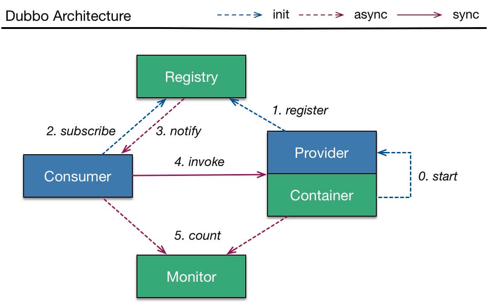

# 常见问题

## 框架的分层设计

​	Business 业务层

- Service

  业务代码的接口与实现

​	RPC

- config 配置层

  对外配置接口，以ServiceConfig、ReferenceConfig为中心

- proxy 服务代理层

  服务接口代理，代理之间进行网络通信

- registry 注册中心层

  封装服务地址的注册和发现，以服务URL为中心

- cluster 路由层

  封装多个提供者的路由和负载均衡，并桥接注册中心

- monitor 监控层

  RPC调用次数和调用时间监控

​	Remoting

- protocol远程调用层

  封装RPC调用

- exchange 信息交换层

  封装请求响应模式，同步转异步，以 Request, Response 为中心

- transport网络传输协议

  抽象`mina`和`netty`为统一接口，以`Message`为中心

- serialize数据序列化层

## 调用流程

调用流程图：

- Provider

  - 第0步，start启动，服务端启动本地服务
  - 第1步，registry注册，注册服务URL到注册中心

- Consumer

  - 第2步，subscribe订阅，订阅使用到的服务
  - 第3步，notify 异步通知，当服务URL地址变化时，会通知客户端。客户端第一次会在本地缓存服务URL信息
  - 第4步，invoke 调用，当调用接口方法时，会通过代理对象，将方法调用转换成网络请求发送到服务端，服务端执行结束后，返回执行结果给客户端

- Monitor

  - 第4步，count，Monitor能够监控服务调用次数和调用时间

## Dubbo调用是同步的吗

​	默认情况下，调用是同步的

## 异常处理

### 官方建议的异常使用方式

- 建议使用异常汇报错误，而不是返回错误码，异常信息能携带更多信息，并且语义更友好
- 如果担心性能问题，在必要时，可以通过 override 掉异常类的 `fillInStackTrace()` 方法为空方法，使其不拷贝栈信息
- 查询方法不建议抛出 checked 异常，否则调用方在查询时将过多的 `try...catch`，并且不能进行有效处理
- 服务提供方不应将 DAO 或 SQL 等异常抛给消费方，应在服务实现中对消费方不关心的异常进行包装，否则可能出现消费方无法反序列化相应异常

### 异常处理逻辑

- 如果provider实现了GenericService接口、直接抛出
- 如果是checked异常，直接抛出
- 在方法签名上有声明，直接抛出
- 异常类和接口类在同一jar包里，直接抛出
- 是JDK自带的异常，直接抛出
- 是Dubbo本身的异常，直接抛出
- 否则，包装成RuntimeException抛给客户端

最后一条这样处理的原因：防止客户端反序列化失败

## 注册中心挂了还可以通信吗？

可以。对于正在运行的 Consumer 调用 Provider 是不需要经过注册中心，所以不受影响。并且，Consumer 进程中，内存已经缓存了 Provider 列表。

那么，此时 Provider 如果下线呢？如果 Provider 是**正常关闭**，它会主动且直接对和其处于连接中的 Consumer 们，发送一条“我要关闭”了的消息。那么，Consumer 们就不会调用该 Provider ，而调用其它的 Provider 。