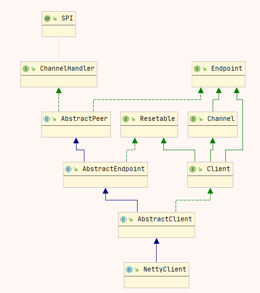

# dubbo服务调用过程

dubbo服务的调用过程比较复杂，涉及到服务降级、发送请求、编解码、序列化、线程派发和响应请求等步骤，调用过程比较复杂，下面介绍大致的调用流程。

## 调用过程


首先**服务消费者**通过代理对象`Proxy`发起远程调用，接着通过网络客户端`Client`将编码后的消息发送到服务端网络层`Server`；`Server`收到消息后，先将消息进行解码，然后将解码后请求经过分发器`Dispatcher`发送到指定的线程池`ThreadPool`上，最后由线程池调用具体的服务实现`Implement`；线程池`ThreadPool`中的线程处理完毕后，把执行结果返回给客户端。


## 调用过程源码分析

### 入口

调用过程的入口是`dubbo`动态生成的代理类，动态生成的代理类逻辑比较简单，示例代码如下：

``` java
public class proxy0 implements ClassGenerator.DC, EchoService, DemoService {
    // 方法数组
    public static Method[] methods;
    private InvocationHandler handler;

    public proxy0(InvocationHandler invocationHandler) {
        this.handler = invocationHandler;
    }

    public proxy0() {
    }

    public String sayHello(String string) {
        // 将参数存储到 Object 数组中
        Object[] arrobject = new Object[]{string};
        // 调用 InvocationHandler 实现类的 invoke 方法得到调用结果
        Object object = this.handler.invoke(this, methods[0], arrobject);
        // 返回调用结果
        return (String)object;
    }

    /** 回声测试方法 */
    public Object $echo(Object object) {
        Object[] arrobject = new Object[]{object};
        Object object2 = this.handler.invoke(this, methods[1], arrobject);
        return object2;
    }
}
```

不管是通过`javassist`还是`jdk`生成的代理类，传入的`invocationHandler`参数都是`InvokerInvocationHandler`类的实例。

### InvokerInvocationHandler

``` java
public class InvokerInvocationHandler implements InvocationHandler {
    private final Invoker<?> invoker;
    public InvokerInvocationHandler(Invoker<?> handler) {
        this.invoker = handler;
    }
    @Override
    public Object invoke(Object proxy, Method method, Object[] args) throws Throwable {
        String methodName = method.getName();
        Class<?>[] parameterTypes = method.getParameterTypes();
        if (method.getDeclaringClass() == Object.class) {
            return method.invoke(invoker, args);
        }
        if ("toString".equals(methodName) && parameterTypes.length == 0) {
            return invoker.toString();
        }
        if ("hashCode".equals(methodName) && parameterTypes.length == 0) {
            return invoker.hashCode();
        }
        if ("equals".equals(methodName) && parameterTypes.length == 1) {
            return invoker.equals(args[0]);
        }
        // 直接调用invoker.invoke方法
        return invoker.invoke(new RpcInvocation(method, args)).recreate();
    }

}
```

上面代码中成员变量`invoker`的实例是通过 `cluster.join`方式得到的，`Cluster`是`dubbo`中的一个SPI接口，默认的实现类是`FailoverCluster`，包装类是`MockClusterWrapper`。

```java
public class MockClusterWrapper implements Cluster {
    private Cluster cluster;
    public MockClusterWrapper(Cluster cluster) {
        this.cluster = cluster;
    }
    @Override
    public <T> Invoker<T> join(Directory<T> directory) throws RpcException {
        return new MockClusterInvoker<T>(directory,
                this.cluster.join(directory));
    }
}
```

所以`invoker`的类型是`MockClusterInvoker`

### MockClusterInvoker

`MockClusterInvoker#invoker`的代码实现如下：

```java
@Override
public Result invoke(Invocation invocation) throws RpcException {
    Result result = null;
    String value = directory.getUrl().getMethodParameter(invocation.getMethodName(), Constants.MOCK_KEY, Boolean.FALSE.toString()).trim();
    if (value.length() == 0 || value.equalsIgnoreCase("false")) {
        //no mock
        result = this.invoker.invoke(invocation);
    } else if (value.startsWith("force")) {
        if (logger.isWarnEnabled()) {
            // log
        }
        //force:direct mock
        result = doMockInvoke(invocation, null);
    } else {
        //fail-mock
        try {
            // 执行被包装的invoker实例的方法
            result = this.invoker.invoke(invocation);
        } catch (RpcException e) {
            if (e.isBiz()) {
                throw e;
            } else {
                if (logger.isWarnEnabled()) {
                    // log
                }
                result = doMockInvoke(invocation, e);
            }
        }
    }
    return result;
}
```

其中包含了服务降级处理。如果没有服务降级，会调用被包装的`invoker`实例的方法。根据上面的分析`invoker`实例的类型是`FailoverClusterInvoker`。

### FailoverClusterInvoker

`FailoverClusterInvoker`的`invoker`中会选择一个`invoker`实例进行调用，`invoker`实例是通过`Protocol#refer`方法得到的。

``` java
public interface Protocol {
    @Adaptive
    <T> Invoker<T> refer(Class<T> type, URL url) throws RpcException;
}
```

假设通信协议是`dubbo`，会执行`DubboInvoker`实例的`invoker`方法

### DubboInvoker

`DubboInvoker`继承自`AbstractInvoker`，并且`AbstractInvoker`实现了`invoker`方法方法，代码如下：

``` java
@Override
public Result invoke(Invocation inv) throws RpcException {
    if (destroyed.get()) {
        // log
    }
    RpcInvocation invocation = (RpcInvocation) inv;
    invocation.setInvoker(this);
    if (attachment != null && attachment.size() > 0) {
        invocation.addAttachmentsIfAbsent(attachment);
    }
    Map<String, String> contextAttachments = RpcContext.getContext().getAttachments();
    if (contextAttachments != null && contextAttachments.size() != 0) {
        invocation.addAttachments(contextAttachments);
    }
    if (getUrl().getMethodParameter(invocation.getMethodName(), Constants.ASYNC_KEY, false)) {
        invocation.setAttachment(Constants.ASYNC_KEY, Boolean.TRUE.toString());
    }
    RpcUtils.attachInvocationIdIfAsync(getUrl(), invocation);


    try {
        // doInvoke 是抽象方法，需要子类实现
        return doInvoke(invocation);
    } catch (InvocationTargetException e) { // biz exception
        Throwable te = e.getTargetException();
        if (te == null) {
            return new RpcResult(e);
        } else {
            if (te instanceof RpcException) {
                ((RpcException) te).setCode(RpcException.BIZ_EXCEPTION);
            }
            return new RpcResult(te);
        }
    } catch (RpcException e) {
        if (e.isBiz()) {
            return new RpcResult(e);
        } else {
            throw e;
        }
    } catch (Throwable e) {
        return new RpcResult(e);
    }
}
```

子类`DubboInvoker`实现了抽象方法`doInoker`方法，代码如下：

```java
protected Result doInvoke(final Invocation invocation) throws Throwable {
    RpcInvocation inv = (RpcInvocation) invocation;
    final String methodName = RpcUtils.getMethodName(invocation);
    inv.setAttachment(Constants.PATH_KEY, getUrl().getPath());
    inv.setAttachment(Constants.VERSION_KEY, version);

    ExchangeClient currentClient;
    if (clients.length == 1) {
        currentClient = clients[0];
    } else {
        currentClient = clients[index.getAndIncrement() % clients.length];
    }
    try {
        boolean isAsync = RpcUtils.isAsync(getUrl(), invocation);
        boolean isOneway = RpcUtils.isOneway(getUrl(), invocation);
        int timeout = getUrl().getMethodParameter(methodName, Constants.TIMEOUT_KEY, Constants.DEFAULT_TIMEOUT);
        if (isOneway) { // 单项调用
            boolean isSent = getUrl().getMethodParameter(methodName, Constants.SENT_KEY, false);
            currentClient.send(inv, isSent);
            RpcContext.getContext().setFuture(null);
            return new RpcResult();
        } else if (isAsync) { // 异步调用
            ResponseFuture future = currentClient.request(inv, timeout);
            RpcContext.getContext().setFuture(new FutureAdapter<Object>(future));
            return new RpcResult();
        } else { // 同步方法调用，默认的调用方式
            RpcContext.getContext().setFuture(null);
            return (Result) currentClient.request(inv, timeout).get();
        }
    } catch (TimeoutException e) {
        throw new RpcException("", e);
    } catch (RemotingException e) {
        throw new RpcException("", e);
    }
}
```

上面代码中 `currentClient`是 `ReferenceCountExchangeClient`的实例，只是在`HeaderExchangeClient`的基础上添加了引用计算的功能，下面继续分析`HeaderExchangeClient`的`request`方法

```java
private final ExchangeChannel channel = new HeaderExchangeChannel(client);

public ResponseFuture request(Object request, int timeout) throws RemotingException {
    // 直接调用 HeaderExchangeChannel 相同签名的方法
    return channel.request(request, timeout);
}
```

### HeaderExchangeChannel

```java
// HeaderExchangeChannel#request
public ResponseFuture request(Object request, int timeout) throws RemotingException {
    if (closed) {
        throw new RemotingException(this.getLocalAddress(), null, "Failed to send request " + request + ", cause: The channel " + this + " is closed!");
    }
    // create request.
    Request req = new Request();
    req.setVersion(Version.getProtocolVersion());
    req.setTwoWay(true);
    req.setData(request);
    DefaultFuture future = new DefaultFuture(channel, req, timeout);
    try {
        channel.send(req);
    } catch (RemotingException e) {
        future.cancel();
        throw e;
    }
    return future;
}
```

从上面的代码中可以看出先构造了一个`request`请求对象，然后再调用`channel.send`方法发送消息。

在`HeaderExchangeClient`的构造函数，可以看到`channel`就是传入的`client`参数。dubbo中默认的传输协议是netty，下面接着分析`NettyClient`。

### NettyClient

NettyClient类的继承关系如下图所示：



`send`方法在`AbstractPeer`中实现的，代码如下

```java
// AbstractPeer#send
public void send(Object message) throws RemotingException {
    send(message, url.getParameter(Constants.SENT_KEY, false));
}
```

```java
// AbstractClient#send
public void send(Object message, boolean sent) throws RemotingException {
    if (send_reconnect && !isConnected()) {
        connect();
    }
    Channel channel = getChannel();
    
    if (channel == null || !channel.isConnected()) {
        throw new RemotingException(this, ""));
    }
    // 调用NettyChannel的send方法
    channel.send(message, sent);
}
```

在`NettyChannel`中包含终于看到了调用nio channel writeAndFlush的代码，如下：

```java
public void send(Object message, boolean sent) throws RemotingException {
    super.send(message, sent);

    boolean success = true;
    int timeout = 0;
    try {
        // 执行nio channel 的 writeAndFlush 方法
        ChannelFuture future = channel.writeAndFlush(message);
        if (sent) {
            timeout = getUrl().getPositiveParameter(Constants.TIMEOUT_KEY, Constants.DEFAULT_TIMEOUT);
            success = future.await(timeout);
        }
        Throwable cause = future.cause();
        if (cause != null) {
            throw cause;
        }
    } catch (Throwable e) {
        throw new RemotingException(this,"", e);
    }

    if (!success) {
        throw new RemotingException(this, "");
    }
}
```

在netty中，数据出栈前还需要编码，下面接着分析数据编码

### 数据编码

编解码器在`NettyClient#doOpen`中定义的，代码如下：

```java
// com.alibaba.dubbo.remoting.transport.netty4.NettyClient#doOpen
protected void doOpen() throws Throwable {
    final NettyClientHandler nettyClientHandler = new NettyClientHandler(getUrl(), this);
    bootstrap = new Bootstrap();
    bootstrap.group(nioEventLoopGroup)
            .option(ChannelOption.SO_KEEPALIVE, true)
            .option(ChannelOption.TCP_NODELAY, true)
            .option(ChannelOption.ALLOCATOR, PooledByteBufAllocator.DEFAULT)
            //.option(ChannelOption.CONNECT_TIMEOUT_MILLIS, getTimeout())
            .channel(NioSocketChannel.class);

    if (getConnectTimeout() < 3000) {
        bootstrap.option(ChannelOption.CONNECT_TIMEOUT_MILLIS, 3000);
    } else {
        bootstrap.option(ChannelOption.CONNECT_TIMEOUT_MILLIS, getConnectTimeout());
    }

    bootstrap.handler(new ChannelInitializer() {

        @Override
        protected void initChannel(Channel ch) throws Exception {
            NettyCodecAdapter adapter = new NettyCodecAdapter(getCodec(), getUrl(), NettyClient.this);
            ch.pipeline()//.addLast("logging",new LoggingHandler(LogLevel.INFO))//for debug
                    .addLast("decoder", adapter.getDecoder())
                    .addLast("encoder", adapter.getEncoder())
                    .addLast("handler", nettyClientHandler);
        }
    });
}
```

其中`getCodec()`默认返回的是`DubboCodec`，里面定义了编码和解码过程，编解码后的消息处理通过 `NettyClientHandler`完成

需要注意 NettyClient的构造函数

```java
public NettyClient(final URL url, final ChannelHandler handler) throws RemotingException {
    super(url, wrapChannelHandler(url, handler));
}

protected static ChannelHandler wrapChannelHandler(URL url, ChannelHandler handler) {
    url = ExecutorUtil.setThreadName(url, CLIENT_THREAD_POOL_NAME);
    url = url.addParameterIfAbsent(Constants.THREADPOOL_KEY, Constants.DEFAULT_CLIENT_THREADPOOL);
    return ChannelHandlers.wrap(handler, url);
}

// ChannelHandlers
public static ChannelHandler wrap(ChannelHandler handler, URL url) {
    return ChannelHandlers.getInstance().wrapInternal(handler, url);
}
protected ChannelHandler wrapInternal(ChannelHandler handler, URL url) {
    return new MultiMessageHandler(new HeartbeatHandler(ExtensionLoader.getExtensionLoader(Dispatcher.class)
                                                        .getAdaptiveExtension().dispatch(handler, url)));
}
```

可以看出原始的`channel`会经过包装，其中一个就是消息分发处理服务Dispatcher，默认是`AllDispatcher`，表示所有的消息处理都会由线程池处理

### 调用服务

`ChannelEventRunnable run`方法中包含了收到消息后的处理，代码如下：

``` java
public void run() {
    if (state == ChannelState.RECEIVED) {
        try {
            handler.received(channel, message);
        } catch (Exception e) {
            logger.warn("" + message, e);
        }
    } else {
        switch (state) {
            case CONNECTED:
                try {
                    handler.connected(channel);
                } catch (Exception e) {
                    logger.warn("" + channel, e);
                }
                break;
            case DISCONNECTED:
                try {
                    handler.disconnected(channel);
                } catch (Exception e) {
                    logger.warn("" + channel, e);
                }
                break;
            case SENT:
                try {
                    handler.sent(channel, message);
                } catch (Exception e) {
                    logger.warn("" + message, e);
                }
            case CAUGHT:
                try {
                    handler.caught(channel, exception);
                } catch (Exception e) {
                    logger.warn("" + exception, e);
                }
                break;
            default:
                logger.warn("unknown state: " + state + ", message is " + message);
        }
    }

}
```

`handler`是`HeaderExchangeHandler`的实例，下面接着分析收到解码后的消息处理

### HeaderExchangeHandler

```java
// HeaderExchangeHandler#received，收到消息后会进入这个方法
public void received(Channel channel, Object message) throws RemotingException {
    channel.setAttribute(KEY_READ_TIMESTAMP, System.currentTimeMillis());
    ExchangeChannel exchangeChannel = HeaderExchangeChannel.getOrAddChannel(channel);
    try {
        if (message instanceof Request) {
            // handle request.
            Request request = (Request) message;
            if (request.isEvent()) {
                handlerEvent(channel, request);
            } else {
                if (request.isTwoWay()) {
                    Response response = handleRequest(exchangeChannel, request);
                    channel.send(response);
                } else {
                    handler.received(exchangeChannel, request.getData());
                }
            }
        } else if (message instanceof Response) {
            handleResponse(channel, (Response) message);
        } else if (message instanceof String) {
            if (isClientSide(channel)) {
                Exception e = new Exception("Dubbo client can not supported string message: " + message + " in channel: " + channel + ", url: " + channel.getUrl());
                logger.error(e.getMessage(), e);
            } else {
                String echo = handler.telnet(channel, (String) message);
                if (echo != null && echo.length() > 0) {
                    channel.send(echo);
                }
            }
        } else {
            handler.received(exchangeChannel, message);
        }
    } finally {
        HeaderExchangeChannel.removeChannelIfDisconnected(channel);
    }
}

Response handleRequest(ExchangeChannel channel, Request req) throws RemotingException {
    Response res = new Response(req.getId(), req.getVersion());
    if (req.isBroken()) {
        Object data = req.getData();

        String msg;
        if (data == null) msg = null;
        else if (data instanceof Throwable) msg = StringUtils.toString((Throwable) data);
        else msg = data.toString();
        res.setErrorMessage("Fail to decode request due to: " + msg);
        res.setStatus(Response.BAD_REQUEST);

        return res;
    }
    // find handler by message class.
    Object msg = req.getData();
    try {
        // handle data.
        Object result = handler.reply(channel, msg);
        res.setStatus(Response.OK);
        res.setResult(result);
    } catch (Throwable e) {
        res.setStatus(Response.SERVICE_ERROR);
        res.setErrorMessage(StringUtils.toString(e));
    }
    return res;
}
```

其中`handler`是在`DubboProtocol`中定义的匿名类，代码如下：

```java
ExchangeHandler requestHandler = new ExchangeHandlerAdapter() {
    @Override
    public Object reply(ExchangeChannel channel, Object message) throws RemotingException {
        if (message instanceof Invocation) {
            Invocation inv = (Invocation) message;
            Invoker<?> invoker = getInvoker(channel, inv);
            // need to consider backward-compatibility if it's a callback
            if (Boolean.TRUE.toString().equals(inv.getAttachments().get(IS_CALLBACK_SERVICE_INVOKE))) {
                String methodsStr = invoker.getUrl().getParameters().get("methods");
                boolean hasMethod = false;
                if (methodsStr == null || methodsStr.indexOf(",") == -1) {
                    hasMethod = inv.getMethodName().equals(methodsStr);
                } else {
                    String[] methods = methodsStr.split(",");
                    for (String method : methods) {
                        if (inv.getMethodName().equals(method)) {
                            hasMethod = true;
                            break;
                        }
                    }
                }
                if (!hasMethod) {
                    // logger
                    return null;
                }
            }
            RpcContext.getContext().setRemoteAddress(channel.getRemoteAddress());
            // 执行invoker方法，
            return invoker.invoke(inv);
        }
        throw new RemotingException(channel, "Unsupported request:" + channel.getLocalAddress());
    }

    // ...省略其他的代码
};
```

上面的`invoke`定义在`AbstractProxyInvoker` 中，代码如下：

```java
public Result invoke(Invocation invocation) throws RpcException {
    try {
        return new RpcResult(doInvoke(proxy, invocation.getMethodName(), invocation.getParameterTypes(), invocation.getArguments()));
    } catch (InvocationTargetException e) {
        return new RpcResult(e.getTargetException());
    } catch (Throwable e) {
        throw new RpcException("" + e.getMessage(), e);
    }
}

protected abstract Object doInvoke(T proxy, String methodName, Class<?>[] parameterTypes, Object[] arguments) throws Throwable;
```

`doInvoke` 是一个抽象方法，这个需要由具体的 Invoker 实例实现。Invoker 实例是在运行时通过 `JavassistProxyFactory `创建的。该方法内部最终会根据调用信息调用具体的服务


