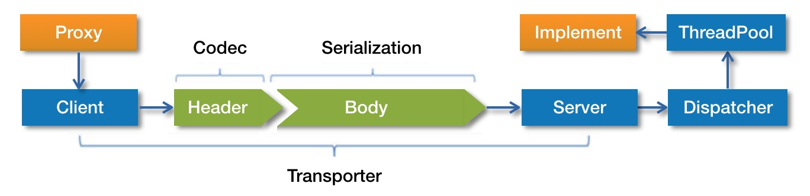

# dubbo服务调用过程

dubbo服务的调用过程比较复杂，涉及到服务降级、发送请求、编解码、序列化、线程派发和响应请求等步骤，调用过程比较复杂，下面介绍大致的调用流程。

## 调用过程




首先**服务消费者**通过代理对象`Proxy`发起远程调用，接着通过网络客户端`Client`将编码后的消息发送到服务端网络层`Server`；`Server`收到消息后，先将消息进行解码，然后将解码后请求经过分发器`Dispatcher`发送到指定的线程池`ThreadPool`上，最后由线程池调用具体的服务实现`Implement`；线程池`ThreadPool`中的线程处理完毕后，把执行结果返回给客户端。


## 调用过程源码分析

### 入口

调用过程的入口是`dubbo`动态生成的代理类，动态生成的代理类逻辑比较简单，示例代码如下：

``` java
public class proxy0 implements ClassGenerator.DC, EchoService, DemoService {
    // 方法数组
    public static Method[] methods;
    private InvocationHandler handler;

    public proxy0(InvocationHandler invocationHandler) {
        this.handler = invocationHandler;
    }

    public proxy0() {
    }

    public String sayHello(String string) {
        // 将参数存储到 Object 数组中
        Object[] arrobject = new Object[]{string};
        // 调用 InvocationHandler 实现类的 invoke 方法得到调用结果
        Object object = this.handler.invoke(this, methods[0], arrobject);
        // 返回调用结果
        return (String)object;
    }

    /** 回声测试方法 */
    public Object $echo(Object object) {
        Object[] arrobject = new Object[]{object};
        Object object2 = this.handler.invoke(this, methods[1], arrobject);
        return object2;
    }
}
```


