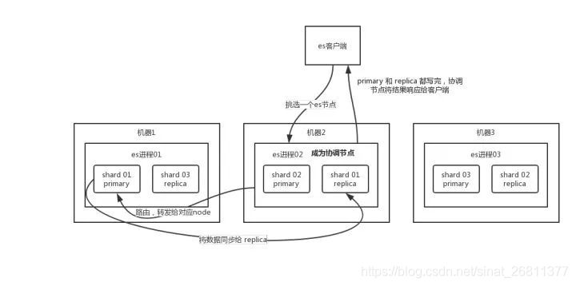

# ElasticSearch

## 简介

es是一个分布式、高拓展、高实时的搜索与数据分析引擎。

它能很方便的使大量数据具有搜索、分析和探索的能力。

具有很强的水平伸缩性。每个索引被分成分片，每个分片包含0个或多个副本。每个节点托管一个或多个分片，并充当协调器将操作委托给正确的分片。再平衡和路由是自动完成的。相关的数据通常存储在同一个索引中，该索引由一个或多个主分片和零个复制分片组成。一旦创建了索引，就不能更改主分片数。

实现原理：首先将用户数据提交到es中，再通过分词控制器将对应的语句分词，将其权重和分词结果一并存入数据，当用户搜索数据的时候，再根据权重将结果排名，打分，再返回结果

## 写数据过程

- 客户端选择一个node发送请求过去，这个node就是协调节点（coordinating node）
- 协调节点对document进行路由，将请求转发给对应的node（primary shard 主分片）
- 实际node上的主分片（primary shard）处理请求，然后将数据同步到replica node（复制节点）
- 协调节点（coordinating node）如果发现所有primary node（主分片）和所有replica node（复制节点）都完成之后，就返回结果

  

## 读数据过程

可以通过doc id来查询，会根据doc id进行hash，判断出来把doc id分配到了哪个shard上面去，从那个shard查询

- 客户端发送请求到任意一个node，成为协调节点（coordinating node）
- 协调节点（coordinating node）对doc_id进行哈希路由，将请求转发到对应的node，此时会使用round-bin随机轮询算法，在primary shard以及其他所有的replica（副本）中随机选择一个，让读请求负载均衡
- 接收请求的node返回document给协调节点（coordinating node）
- 协调节点（coordinate node）返回document给客户端

## 搜索数据过程

- 客户端发送请求到一个协调节点（coordinate node）
- 协调节点请搜索请求转发到shard对应的primary shard或replica shard
- 每个shard将自己的请求结果（doc id）发送给协调节点，由协调节点进行数据的合并、排序、分页等操作，产出最终结果
- 介者协调节点根据doc id去各个节点拉去实际的document数据，最终返回给客户端

## 倒排索引

每个文档都对应一个文档ID，文档内容被称为一些列关键字的集合

例如，文档1经过分词，提取了20个关键词，每个关键词都会记录它在文档中出现的次数和出现位置

那么，倒排索引就是根据**关键词到文档ID**的映射，每个关键词都对应一系列的文档(document)

## 底层lucene

是一个jar包，里面包含了封装好的各种建立倒排索引的算法代码

开发的时候，引入lucence.jar，然后基于lucence的API开发

通过lucene，我们可以将已有的数据建立索引，lucene会在本地磁盘上，给我们组织索引的数据结构

## 参考

[es写入、查询数据的原理和倒排索引](https://xiaoshuwen.blog.csdn.net/article/details/102667279)

