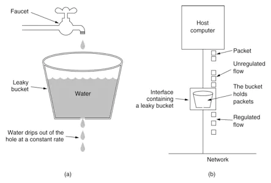
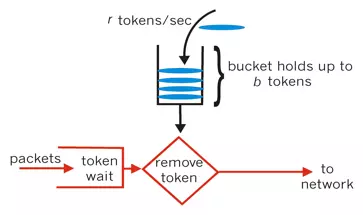

# RateLimiter

## 前言

在高并发系统中有三种方式保护系统：缓存、降级、限流

- 缓存：提升系统访问速度和增大系统处理容量
- 降级：当服务出现问题或者影响到核心流程时，需要暂时屏蔽掉，待高峰或者问题解决后再打开
- 限流：通过对并发访问/请求进行限速，或者对一个时间窗口内的请求进行限速来保护系统，一旦达到限制速率则可以拒绝服务、排队或等待、降级等处理

## 常用的限流算法

- 漏桶算法
  - 漏桶算法思路很简单，水（请求）先进入到漏桶里，漏桶以一定的速度出水，当水流入速度过大会直接溢出，可以看出漏桶算法能强行限制数据的传输速率
  - 
- 令牌桶算法
  - 对于很多应用场景来说，除了要求能够限制数据的平均传输速率外，还要求允许某种程度的突发传输。这时候漏桶算法可能就不合适了，令牌桶算法更为适合。如图所示，令牌桶算法的原理是系统会以一个恒定的速度往桶里放入令牌，而如果请求需要被处理，则需要先从桶里获取一个令牌，当桶里没有令牌可取时，则拒绝服务。
  - 

## RateLimiter 介绍

`RateLimiter`是Guava中提供的限流工具。它基于令牌桶算法实现流量限制、使用十分方便

> Guava有两种限流模式，一种为稳定模式(SmoothBursty:令牌生成速度恒定)，一种为渐进模式(SmoothWarmingUp:令牌生成速度缓慢提升直到维持在一个稳定值) 两种模式实现思路类似，主要区别在等待时间的计算上，下面介绍 SmoothBursty的使用和实现

## RateLimiter使用

``` java
@Test
public void testAcquire() {
    RateLimiter limiter = RateLimiter.create(1);

    for(int i = 1; i < 10; i = i + 2 ) {
        // acquire阻塞的方式获取锁
        // tryAcquire(int permits, long timeout, TimeUnit unit)通过等待超时时间的方式获取令牌，如果超timeout为0，则代表非阻塞，获取不到立即返回
        double waitTime = limiter.acquire(i);
        System.out.println("cutTime=" + System.currentTimeMillis() + " acq:" + i + " waitTime:" + waitTime);
    }
}
```

## RateLimiter 的创建

```java
public static RateLimiter create(double permitsPerSecond) {
    return create(permitsPerSecond, SleepingStopwatch.createFromSystemTimer());
}

static RateLimiter create(double permitsPerSecond, SleepingStopwatch stopwatch) {
    RateLimiter rateLimiter = new SmoothBursty(stopwatch, 1.0 /* maxBurstSeconds */);
    rateLimiter.setRate(permitsPerSecond);
    return rateLimiter;
}
```

`SmoothBursty`构造函数有两个参数:

- SleepingStopwatch：guava中的一个时钟类实例，会通过这个来计算时间和令牌
- maxBurstSeconds：在ReteLimiter未使用时，最多保存几秒的令牌，默认是 1

`SmoothBursty`继承`SmoothRateLimiter`，它的所有属性字段如下：

```java
// 在ReteLimiter未使用时，最多保存几秒的令牌，默认是 1
final double maxBurstSeconds;

// =============== SmoothRateLimiter ===============
// 当前存储的令牌数
double storedPermits;

// 最大令牌数
double maxPermits;
// 添加令牌的时间间隔
double stableIntervalMicros;
// 下一次请求可以获取令牌的起始时间
// 上次请求令牌后，下次请求需要等到nextFreeTicketMicros时刻才能获取令牌
private long nextFreeTicketMicros = 0L;
```

## setRate方法

``` java
public final void setRate(double permitsPerSecond) {
    checkArgument(
        permitsPerSecond > 0.0 && !Double.isNaN(permitsPerSecond), "rate must be positive");
    synchronized (mutex()) {
        doSetRate(permitsPerSecond, stopwatch.readMicros());
    }
}

final void doSetRate(double permitsPerSecond, long nowMicros) {
    resync(nowMicros);
    // 微秒 / permitsPerSecond == 每隔多少微秒才能产生一个令牌
    double stableIntervalMicros = SECONDS.toMicros(1L) / permitsPerSecond;
    this.stableIntervalMicros = stableIntervalMicros;
    doSetRate(permitsPerSecond, stableIntervalMicros);
}
// SmoothRateLimiter.SmoothBursty#doSetRate
void doSetRate(double permitsPerSecond, double stableIntervalMicros) {
    double oldMaxPermits = this.maxPermits;
    // maxBurstSeconds 默认1s
    // maxBurstSeconds * permitsPerSecond == 1s 内产生的令牌数，即最大的令牌数
    maxPermits = maxBurstSeconds * permitsPerSecond;
    if (oldMaxPermits == Double.POSITIVE_INFINITY) {
        // if we don't special-case this, we would get storedPermits == NaN, below
        storedPermits = maxPermits;
    } else {
        // storedPermits 已经存储的令牌数
        storedPermits =
            (oldMaxPermits == 0.0)
            ? 0.0 // initial state
            // 类似 按比较调整，如果最大令牌数有变化
            : storedPermits * maxPermits / oldMaxPermits;
    }
}
```

## acquire 阻塞方式获取锁

``` java
public double acquire(int permits) {
    // 获取permits个令牌需要等待的毫秒数
    long microsToWait = reserve(permits);
    // 通过睡眠方式等待
    stopwatch.sleepMicrosUninterruptibly(microsToWait);
    // 返回需要等待的时间 单位s
    return 1.0 * microsToWait / SECONDS.toMicros(1L);
}

final long reserve(int permits) {
    checkPermits(permits);
    synchronized (mutex()) {
        return reserveAndGetWaitLength(permits, stopwatch.readMicros());
    }
}
final long reserveAndGetWaitLength(int permits, long nowMicros) {
    long momentAvailable = reserveEarliestAvailable(permits, nowMicros);
    return max(momentAvailable - nowMicros, 0);
}

final long reserveEarliestAvailable(int requiredPermits, long nowMicros) {
    // 更新存储的令牌数和下次生成令牌的时间
    resync(nowMicros);
    long returnValue = nextFreeTicketMicros;
    double storedPermitsToSpend = min(requiredPermits, this.storedPermits);
    double freshPermits = requiredPermits - storedPermitsToSpend;
    // 计算需要等待的微秒数
    long waitMicros =
        storedPermitsToWaitTime(this.storedPermits, storedPermitsToSpend) // return 0
        + (long) (freshPermits * stableIntervalMicros);
    // 更新下次生成令牌的时间
    this.nextFreeTicketMicros = LongMath.saturatedAdd(nextFreeTicketMicros, waitMicros);
    // 更新存储的令牌数
    this.storedPermits -= storedPermitsToSpend;
    return returnValue;
}
```

## tryAcquire 尝试获取锁

``` java
public boolean tryAcquire() {
    return tryAcquire(1, 0, MICROSECONDS);
}
public boolean tryAcquire(int permits, long timeout, TimeUnit unit) {
    // 获取等待的微秒数
    long timeoutMicros = max(unit.toMicros(timeout), 0);
    checkPermits(permits);
    long microsToWait;
    synchronized (mutex()) {
        long nowMicros = stopwatch.readMicros();
        // 判断 timeoutMicros + nowMicros 是否 >= 下次令牌产生时间
        if (!canAcquire(nowMicros, timeoutMicros)) {
            return false;
        } else {
            microsToWait = reserveAndGetWaitLength(permits, nowMicros);
        }
    }
    stopwatch.sleepMicrosUninterruptibly(microsToWait);
    return true;
}

private boolean canAcquire(long nowMicros, long timeoutMicros) {
    // queryEarliestAvailable(nowMicros) = nextFreeTicketMicros
    return queryEarliestAvailable(nowMicros) - timeoutMicros <= nowMicros;
}
```

