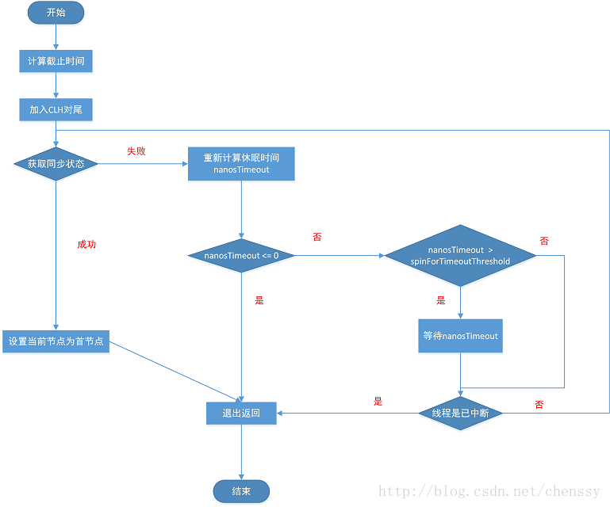

# AQS

AQS（AbstractQueuedSynchronizer ）队列同步器，它是构建其他锁或者同步组件的基础框架，诸如ReentrantLock、ReentrantReadWriteLock、CountDownLatch等等。

AQS采用模板方法设计模式，子类通过继承的方式，实现它的抽象方法来管理同步状态。

AQS实现的同步主要分为3类

- 独占式获取和释放同步状态
- 共享式获取和释放同步状态
- 查询同步队列中的等待线程情况

## 独占式

### acquire 独占式获取实现流程

acquire 是一个模板方法，代码如下：

``` java
public final void acquire(int arg) {
    if (!tryAcquire(arg) &&
        acquireQueued(addWaiter(Node.EXCLUSIVE), arg))
        selfInterrupt();
}
```

`tryAcquire`尝试获取独占锁，需要用户自己去实现。如果获取独占锁失败，执行下面的两步

1. `addWaiter(Node.EXCLUSIVE)` 以独占的方式添加当前线程到CLH同步队列中
2. `acquireQueued` 尝试获取已在队列中的线程

#### addWaiter(Node.EXCLUSIVE)

根据传入参数`Node.EXCLUSIVE`，表示已独占模式获取锁

具体实现代码如下：

```java
private Node addWaiter(Node mode) {
    Node node = new Node(Thread.currentThread(), mode);
    // Try the fast path of enq; backup to full enq on failure
    Node pred = tail;
    if (pred != null) {
        node.prev = pred;
        if (compareAndSetTail(pred, node)) {
            pred.next = node;
            return node;
        }
    }
    enq(node);
    return node;
}
```

如果尾节点`pred`为`null`或者`node`没有被设置成新的尾节点，则执行`enq`方法，将新节点添加到同步队列中

``` java
private Node enq(final Node node) {
    for (;;) {
        Node t = tail;
        if (t == null) { // Must initialize
            if (compareAndSetHead(new Node()))
                tail = head;
        } else {
            node.prev = t;
            if (compareAndSetTail(t, node)) {
                t.next = node;
                return t;
            }
        }
    }
}
```

根据上面的代码可以看出：

- 如果尾节点`tail`是`null`，会构造一个空的节点；头/尾节点同时指向这个空的节点
- 头节点的下一个元素才指向`node`，这也是为什么要获取前置节点的原因
- 通过for (;;)死循环，`node`最终都会通过CAS操作添加到CLH同步队列中

队列中元素之间的关系如下图所示：


#### acquireQueued

将线程添加到同步队列后，下一步就是不断的从同步队列中获取线程

``` java
final boolean acquireQueued(final Node node, int arg) {
    boolean failed = true; // 记录是否获取同步状态成功
    try {
        // 记录是否发生了线程中断
        boolean interrupted = false;
        for (;;) {
            // 获取node节点的前驱节点
            final Node p = node.predecessor();
            // 当前线程的前驱节点是头结点，且同步状态成功
            if (p == head && tryAcquire(arg)) {
                setHead(node);
                p.next = null; // help GC
                failed = false;
                return interrupted;
            }
            // 判断是否需要park当前线程
            if (shouldParkAfterFailedAcquire(p, node) &&
                parkAndCheckInterrupt())
                interrupted = true;
        }
    } finally {
        if (failed) // 获取同步状态发生异常，取消获取
            cancelAcquire(node);
    }
}
```

由上面的代码，可以看出

- 设置新的头部节点时，会将`thread`、`prev`属性设置为`null`，这保证了头节点永远是一个空节点
- 如果`node`的前驱节点`p`是`head`头节点，会再试尝试获取一次锁
- CLH队列**出队**的过程很简单，只需要调用`setHead`即可，在这个过程是**不需要使用 CAS 来保证**的，因为**只有一个**线程，能够成功获取到同步状态（`tryAcquire`尝试获取**独占锁**）

##### shouldParkAfterFailedAcquire

``` java
private static boolean shouldParkAfterFailedAcquire(Node pred, Node node) {
    int ws = pred.waitStatus; // 获取前驱节点的状态
    if (ws == Node.SIGNAL) // 表示后继节点（当前节点）处于等待状态
        
        return true;
    if (ws > 0) { // CANCELLED 当前节点对应的线程已经被取消了
        do {
            node.prev = pred = pred.prev;
        } while (pred.waitStatus > 0);
        pred.next = node;
    } else { 
		// <=0 PROPAGATE 或 0（初始值）
        // 等待状态不会是CONDITION，因为它用在 ConditonObject 中
        compareAndSetWaitStatus(pred, ws, Node.SIGNAL);
    }
    return false;
}
```

方法中会判断每个节点`node`的状态（存放在前驱节点`pred`中），根据状态值的不同，执行不同的分支

1. 如果`ws == SIGNAL`，返回`true`，线程会park
2. 如果`ws > 0`，目前只要`CANCELLED`，表示线程已经被取消了，需要不断向前找，直到找到一个前驱节点waitStats不是CANCELLED的为止
3. 如果`ws <= 0`，表示PROPAGATE或0（初始值），尝试CAS设置前驱节点为`SIGNAL`，标记当前节点处于等待状态；如果成功，下一次进入该方法时，会执行分支1；

如果`shouldParkAfterFailedAcquire` 返回`ture`，会执行 `parkAndCheckInterrupt`

``` java
private final boolean parkAndCheckInterrupt() {
    LockSupport.park(this);
    return Thread.interrupted();
}
```

利用LockSupport park方法暂停当前线程，线程被唤醒后，返回线程是否被中断状态并重置中断状态

#### cancelAcquire

``` java
private void cancelAcquire(Node node) {
    // Ignore if node doesn't exist
    if (node == null)
        return;

    node.thread = null;

    // Skip cancelled predecessors
    Node pred = node.prev;
    while (pred.waitStatus > 0)
        node.prev = pred = pred.prev;

    // predNext is the apparent node to unsplice. CASes below will
    // fail if not, in which case, we lost race vs another cancel
    // or signal, so no further action is necessary.
    Node predNext = pred.next; // 获取pred的下一个节点 predNext
	// 从表面上看 predNext 和 node 是等价的
    // 但是在多线程并发的情况下，pred.next会更改，如代码中
    // compareAndSetNext(pred, predNext, null) 和 compareAndSetNext(pred, predNext, next)
    // 如果设置失败，说明当前线程和其它线程竞争失败，
    // 不需要做其它逻辑，因为 pred 的下一个节点已经被其它线程设置成功。
    
    // Can use unconditional write instead of CAS here.
    // After this atomic step, other Nodes can skip past us.
    // Before, we are free of interference from other threads.
    node.waitStatus = Node.CANCELLED;

    // If we are the tail, remove ourselves.
    if (node == tail && compareAndSetTail(node, pred)) {
        compareAndSetNext(pred, predNext, null);
    } else {
        // If successor needs signal, try to set pred's next-link
        // so it will get one. Otherwise wake it up to propagate.
        int ws;
        if (pred != head &&
            ((ws = pred.waitStatus) == Node.SIGNAL ||
             (ws <= 0 && compareAndSetWaitStatus(pred, ws, Node.SIGNAL))) &&
            pred.thread != null) {
            Node next = node.next;
            if (next != null && next.waitStatus <= 0)
                compareAndSetNext(pred, predNext, next);
        } else {
            unparkSuccessor(node);
        }

        node.next = node; // help GC
    }
}
```

从上面的代码可以看出

- node.waitStatus = Node.CANCELLED

  - 这里可以使用**直接写**，而不是 CAS
  - 在这个操作之后，其它 Node 节点可以忽略 `node`
  - 我们不受其他线程的干扰

- 设置`pred`的新的下一个节点，分三种情况

  - node 是**尾节点**
  - `pred`非首节点，red的**等待状态**为 `Node.SIGNAL` ，或者可被 **CAS** 为 `Node.SIGNAL`并且`pred`的线程非空
  - 其他情况调用`unparkSuccessor`唤醒下一个节点的线程等待

- `node.next = node` node的`next`指向自己

  next字段的javadoc上有说明，最后一句：**The next field of cancelled nodes is set to point to the node itself instead of null, to make life easier for isOnSyncQueue.**

### acquireInterruptibly 独占式获取响应中断实现流程

上面说的方法`acquire`不会响应中断，对线程进行中断操作后，该线程会依然位于CLH同步队列中，等待着获取同步状态。为了**响应中断**，AQS 提供了 `acquireInterruptibly(int arg)` 方法。该方法在等待获取同步状态时，如果当前线程被中断了，会**及时**响应中断（**`LockSupport.park`会响应线程中断，中断状态也会被设置为true，但是不会抛出InterruptedException异常**），并抛出`InterruptedException`异常。

下面分析代码实现

``` java
public final void acquireInterruptibly(int arg)
    throws InterruptedException {
    if (Thread.interrupted())
        throw new InterruptedException();
    if (!tryAcquire(arg))
        doAcquireInterruptibly(arg);
}
```

1. 首先检测线程是否已经中断了，如果是抛出异常
2. 使用`tryAcquire`尝试获取同步状态，如果成功则直接返回
3. 最后调用`doAcquireInterruptibly`自旋获取同步状态，获取抛出`InterruptedException`异常

#### doAcquireInterruptibly

``` java
private void doAcquireInterruptibly(int arg)
    throws InterruptedException {
    final Node node = addWaiter(Node.EXCLUSIVE);
    boolean failed = true;
    try {
        for (;;) {
            final Node p = node.predecessor();
            if (p == head && tryAcquire(arg)) {
                setHead(node);
                p.next = null; // help GC
                failed = false;
                return;
            }
            if (shouldParkAfterFailedAcquire(p, node) &&
                parkAndCheckInterrupt())
                throw new InterruptedException();
        }
    } finally {
        if (failed)
            cancelAcquire(node);
    }
}
```

从上面的代码可以看出和方法`acquireQueued`很相似，只是在中断方法处不再是使用 `interrupted` 标志，而是直接抛出 InterruptedException 异常

### tryAcquireNanos 独占式超时获取

#### tryAcquireNanos 流程图



#### tryAcquireNanos代码实现：

```java
public final boolean tryAcquireNanos(int arg, long nanosTimeout)
        throws InterruptedException {
    if (Thread.interrupted())
        throw new InterruptedException();
    return tryAcquire(arg) ||
        doAcquireNanos(arg, nanosTimeout);
}
```

1. 先检查该线程是否已经中断了，如果是，抛出`InterruptedException`中断异常
2. `tryAcquire`尝试获取同步状态，如果成功则直接返回
3. `doAcquireNanos`自旋获取同步状态，或者超时后返回获取同步状态失败

##### doAcquireNanos

``` java
static final long spinForTimeoutThreshold = 1000L;

private boolean doAcquireNanos(int arg, long nanosTimeout)
    throws InterruptedException {
    if (nanosTimeout <= 0L)
        return false;
    final long deadline = System.nanoTime() + nanosTimeout;
    final Node node = addWaiter(Node.EXCLUSIVE);
    boolean failed = true;
    try {
        for (;;) {
            final Node p = node.predecessor();
            if (p == head && tryAcquire(arg)) {
                setHead(node);
                p.next = null; // help GC
                failed = false;
                return true;
            }
            nanosTimeout = deadline - System.nanoTime();
            if (nanosTimeout <= 0L)
                return false;
            if (shouldParkAfterFailedAcquire(p, node) &&
                nanosTimeout > spinForTimeoutThreshold)
                LockSupport.parkNanos(this, nanosTimeout);
            if (Thread.interrupted())
                throw new InterruptedException();
        }
    } finally {
        if (failed)
            cancelAcquire(node);
    }
}
```

根据上面的代码可以看出：

- 先将当前线程添加到CLH同步队列中
- 判断`node`的前驱节点`p`是否头节点，如果是尝试获取同步资源
- 判断是否超时（`nanosTimeout <= 0`），超时返回`false`
- `shouldParkAfterFailedAcquire`和之前的判断一样，判断是否应该暂停线程
- `Thread.interrupted()`检查线程是否被中断，中断后抛出`InterruptedException`
- 最后如果获取同步状态异常，执行`cancelAcquire`取消获取

### release 独占式同步状态释放实现流程

当线程获取同步状态后，执行完相应的逻辑后，就需要将独占模式`relase`，`release`的方法实现如下：

``` java
public final boolean release(int arg) {
    if (tryRelease(arg)) {
        Node h = head;
        if (h != null && h.waitStatus != 0)
            unparkSuccessor(h);
        return true;
    }
    return false;
}
```

`tryRelease`需要子类去实现，表示需要执行释放。当`tryRelease`执行完成后，获取`head`节点的一个副本（防止方法执行过程中被更改了），如果`waitStatus `不为0的话，执行`unparkSuccessor`（unpark后继节点）

#### unparkSuccessor 唤醒后继节点

``` java
private void unparkSuccessor(Node node) {
    /*
     * If status is negative (i.e., possibly needing signal) try
     * to clear in anticipation of signalling.  It is OK if this
     * fails or if status is changed by waiting thread.
     */
    int ws = node.waitStatus;
    if (ws < 0)
        compareAndSetWaitStatus(node, ws, 0);

    /*
     * Thread to unpark is held in successor, which is normally
     * just the next node.  But if cancelled or apparently null,
     * traverse backwards from tail to find the actual
     * non-cancelled successor.
     */
    Node s = node.next;
    if (s == null || s.waitStatus > 0) {
        s = null;
        for (Node t = tail; t != null && t != node; t = t.prev)
            if (t.waitStatus <= 0)
                s = t;
    }
    if (s != null)
        LockSupport.unpark(s.thread);
}
```

代码逻辑相对来说比较简单，可以为什么要从`tail`尾节点开始呢，而不是从 `node.next` 开始呢？原因在于，取消的 `node.next.next` 指向的是 `node.next` 自己（`cancelAcquire`方法中的末尾，设置`node.next = node`）。如果顺序遍历下去，会导致**死循环**。所以此时，**只能**采用 `tail` 回溯的办法，找到第一个( 不是**最新**找到的，而是**最前序的** )可用的线程。

## 共享式

与独占式的区别：可以有**多个线程**获取同步状态

### acquireShared 共享式同步状态获取

``` java
public final void acquireShared(int arg) {
    if (tryAcquireShared(arg) < 0)
        doAcquireShared(arg);
}
```

`tryAcquireShared(int arg)`尝试获取同步状态，获取成功则设置锁状态并返回`>=0`，否则，获取失败，返回`<0`。若获取成功，直接返回，不用`线程阻塞`；否则，执行`doAcquireShared`自旋直到获得同步状态成功。

#### doAcquireShared

代码实现如下：

``` java
private void doAcquireShared(int arg) {
    final Node node = addWaiter(Node.SHARED); // 共享式节点，添加同步节点尾部
    boolean failed = true;
    try {
        boolean interrupted = false;
        for (;;) {
            final Node p = node.predecessor(); // 获取node的前驱节点
            if (p == head) {
                int r = tryAcquireShared(arg); // 尝试获取共享锁
                if (r >= 0) {
                    setHeadAndPropagate(node, r);
                    p.next = null; // help GC
                    if (interrupted)
                        selfInterrupt();
                    failed = false;
                    return;
                }
            }
            if (shouldParkAfterFailedAcquire(p, node) &&
                parkAndCheckInterrupt())
                interrupted = true;
        }
    } finally {
        if (failed)
            cancelAcquire(node);
    }
}
```

大体和`acquireQueued`方法逻辑基本相同，`setHeadAndPropagate`设置新的首节点，并根据条件唤醒下一个节点

#### setHeadAndPropagate

```java
private void setHeadAndPropagate(Node node, int propagate) {
    Node h = head; // Record old head for check below
    setHead(node);
    /*
     * Try to signal next queued node if:
     *   Propagation was indicated by caller,
     *     or was recorded (as h.waitStatus either before
     *     or after setHead) by a previous operation
     *     (note: this uses sign-check of waitStatus because
     *      PROPAGATE status may transition to SIGNAL.)
     * and
     *   The next node is waiting in shared mode,
     *     or we don't know, because it appears null
     *
     * The conservatism in both of these checks may cause
     * unnecessary wake-ups, but only when there are multiple
     * racing acquires/releases, so most need signals now or soon
     * anyway.
     */
    // propagate > 0 ：同步状态还能被其他线程获取
    // h 或者 head 判断等待状态 为 Node.PROPAGATE 或者 Node.SIGNAL，可以继续向下唤醒
    if (propagate > 0 || h == null || h.waitStatus < 0 ||
        (h = head) == null || h.waitStatus < 0) {
        Node s = node.next;
        if (s == null || s.isShared())
            doReleaseShared(); // 唤醒后继节点
    }
}
```

#### doReleaseShared

```java
private void doReleaseShared() {
    for (;;) {
        Node h = head;
        // 队列不为空并且有后继节点
        if (h != null && h != tail) {
            int ws = h.waitStatus;
            if (ws == Node.SIGNAL) {
                if (!compareAndSetWaitStatus(h, Node.SIGNAL, 0))
                    continue;            // loop to recheck cases
                unparkSuccessor(h);
            }
            else if (ws == 0 &&
                     !compareAndSetWaitStatus(h, 0, Node.PROPAGATE))
                continue;                // loop on failed CAS
        }
        // 如果过程中head被修改了则重试
        if (h == head)                   // loop if head changed
            break;
    }
}
```

###  releaseShared 共享式同步状态释放

``` java
public final boolean releaseShared(int arg) {
    if (tryReleaseShared(arg)) {
        doReleaseShared();
        return true;
    }
    return false;
}
```

主要逻辑还是在`doReleaseShared`方法中，前面已经介绍了

`共享式获取响应中断` 和 `共享式超时获取` 的`acquireShared`方法类似

