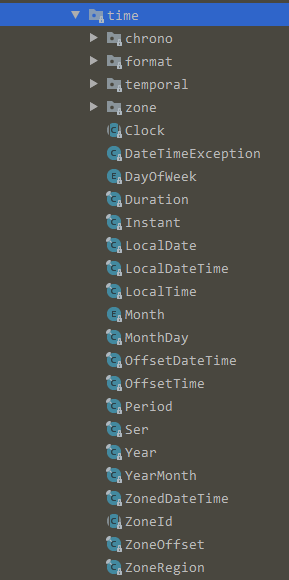

## java 8 新的日期时间API

### 新增的API在java.time包下，如下图所示

>java.time：基本包；这个包下定义的类主要包括时刻，持续时间，日期，时间，时区和时段；**所有的类都是不可变的，线程安全的**
> java.time.chrono：除默认ISO之外的日历系统的通用API，可以扩展AbstractChronology类来创建自己的日历系统
> java.format：包含解析和格式化日期时间对象的类，如DateTimeFormatter、DateTimeFormatterBuilder
> java.time.temporal：包含日期时间使用的字段和单位，以及日期时间调整器；

下面分包介绍主要类的和用法

### java.time

#### LocalDate
>没有时区的日期
``` java
// 当前日期
LocalDate today = LocalDate.now();

// 根据年月日构造时间
LocalDate other = LocalDate.of(2018, 3, 18);

// ISO yyyy-MM-dd字符串转换
LocalDate.parse("2018-02-28");
// 自定义格式转换
LocalDate.parse("20180228", DateTimeFormatter.ofPattern("yyyyMMdd"));

// 下一天
today.plusDays(1);
// 本月第一天
today.with(TemporalAdjusters.firstDayOfMonth());
```
#### LocalTime
>代表时间，没有日期和时区

``` java
// 当前时间
LocalTime time = LocalTime.now();
// 00：00
time = LocalTime.MIN;

// 12：00 中午
time = LocalTime.NOON;

// 清除毫秒和微秒数
time.withSecond(0).withNano(0);// 23:50:00

// 构造方法
LocalTime.of(23, 51, 0)
// 根据字符串构造，默认支持的格式hh:mm、hh:mm:ss、hh:mm:ss.SSS
LocalTime.parse("23:53:25")
```

#### LocalDateTime
>没有时区的日期时间

``` java
// 当前时间
LocalDateTime.now();

//LocalDateTime.of 根据LocalDate LocalTime 或者年月日时分来构造

// LocalDateTime和Date转换，转换成Instant对象后可以相互转换

```

#### OffsetDateTime
>包含时区的DateTime，例如2018-03-03T10:15:30+01:00
>OffSetDateTimes对计算机友好的


#### ZonedDateTime
>在OffsetDateTime上添加了时区，例如2018-03-03T10:15:30+01:00 Europe/Paris
>ZoneDateTime对人更友好

#### Period 
>以年月日衡量日期之间的差值。比如1年10个月5天。Period.between只接收LocalDate类型数据

#### Duration
>以秒和纳秒表示时间的差值。Period.between参数为Temporal，但是必须支持纳秒或者秒单位

### java.temoral

#### ChronoField
>一套标准的字段。这组字段提供基于字段的访问来操纵日期，时间或日期时间。
>通长通过with方法进行设置

#### ChronoUnit
>标准的时间日期单位。ChronoUnit.between可以计算时间的差值。它和Duration类似，内部实现都是调用Temporal.util方法。计算时间的差值时时间单位必须支持该单位。比如使用ChronoUnit.MONTHS计算时间的月份差值时，时间单位必须支持月份。ChronoUnit.MONTHS计算月份查询时需要注意，可以查看LocalDate.monthsUntil了解它的计算逻辑

#### TemporalAdjusters
>包含常用的日期操作方法。
>比如：
>*  找到本月的第一天或最后一天
>* 找到下个月的第一天
>* 找到一年中的第一个或最后一天
>* 找到明年的第一天
>* 在一个月内找到第一个或最后一个星期，例如“6月的第一个星期三”
>* 找到下一个或前几个星期，例如“下周四”

### java.format
	格式化和解析日期的相关类

#### DateTimeFormatter
>格式化和解析日期的主要类，常用方法 DateTimeFormatter.ofPattern

#### DateTimeFormatterBuilder
>有些复杂的格式化和解析可以使用此类。比如你想把yyyyMM类型的日期转换成LocalDate对象，应该不包含天信息，直接转换会出错。这时你可以通过此构造器指定一个默认值。（当然这个例子还有其他实现方式，不如先转换成YearMonth对象等）

```java
DateTimeFormatter formatter = new DateTimeFormatterBuilder()
                                .appendPattern("yyyyMM")
                                .parseDefaulting(ChronoField.DAY_OF_MONTH, 1)
                                .toFormatter();
LocalDate localDate = LocalDate.parse(date, formatter);                          
```
	


