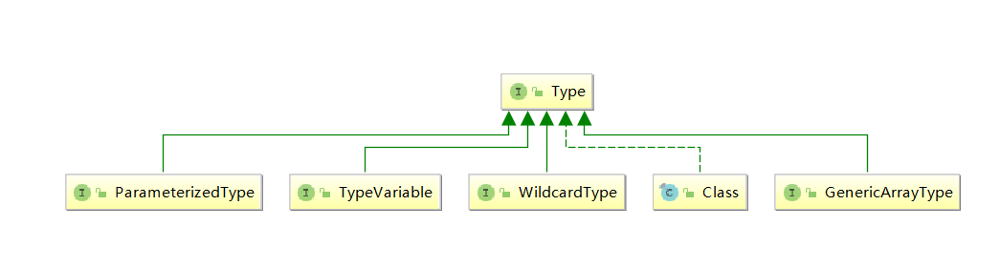

# Type介绍

Java中所有类型的父类、所以的类型如下

- 原始类型（raw types对应Class）
- 参数化类型（parameterized types对应ParameterizedType）
- 数组类型（array types对应 GenericArrayType）
- 类型变量（TypeVariable）
- 原生类型（primitive types对应 Class）

## 接口直接的关系如下



## ParameterizedType
泛型，带有k,V,?的对象，例如：
    List<T>, Map<K,V>，Class<?> 中的参数对象

下面的类型不是
```java
Set set = null;
Map map = null;
```

### 主要方法
+ Type[] getActualTypeArguments()
  
    返回泛型<>中的实际类型数组；比如`List<Integer> `返回Integer
+ Type getRawType()

    返回泛型<>前面的对象；比如List<?> 返回List
+ Type getOwnerType()

    返回这个 ParameterizedType 所在的类的 Type（注意当前的 ParameterizedType 必须属于所在类的 member）；

    比如 Map<String,Person> map 这个 ParameterizedType 的 getOwnerType() 为 null，而 Map.Entry<String, String>entry 的 getOwnerType() 为 Map 所属于的 Type

### 代码示例：

```Java
public class ParameterizedTypeTest {

    private List list;
    private List<String> list2;
    private List<?> list3;

    @Test
    public void testList() throws NoSuchFieldException {
        testFieldInfo("list");
        // class java.lang.Class
    }
    @Test
    public void testList2() throws NoSuchFieldException {
        testFieldInfo("list2");
        // class sun.reflect.generics.reflectiveObjects.ParameterizedTypeImpl
    }
    @Test
    public void testList3() throws NoSuchFieldException {
        testFieldInfo("list3");
        // class sun.reflect.generics.reflectiveObjects.ParameterizedTypeImpl
    }
    private void testFieldInfo(String name) throws NoSuchFieldException {
        Field field = ParameterizedTypeTest.class.getDeclaredField(name);
        Type type = field.getGenericType();
        System.out.println(type.getClass());
        Assert.assertTrue(type instanceof ParameterizedType);
    }
}
```

## TypeVariable
类型变量，泛型中的变量 ，例如：`T t = null`等变量

### 主要方法
+ getBounds

    获取泛型的上界，默认Object（为什么没有下边界？类定义时只有 `public class Test<T extends Number>`）
    
+ getHenericDeclaration

    获取声明该变量的实体（及获得类、方法或构造器名称）

+ getName
  
    获取泛型的名称 即 K V E等等

### 代码例如：
```java
public class TypeVariableTest<T extends Number & Serializable, V> {
    private T t;
    private V v;
    @Test
    public void testField() throws NoSuchFieldException {
        Field field = TypeVariableTest.class.getDeclaredField("t");
        Type type = field.getGenericType();
        System.out.println(type.getClass());
    }
    @Test
    public void testMethod() throws NoSuchMethodException {
        Method method = TypeVariableTest.class.getDeclaredMethod("getMapper");
        Type returnType = method.getGenericReturnType();
        Assert.assertTrue(TypeVariable.class.isAssignableFrom(returnType.getClass()) );// true
        TypeVariable typeVariable = (TypeVariable) returnType;
        // 获取 T extends Number & Serializable 中 extends后面的内容；没有默认Object
        for (Type bound : typeVariable.getBounds()) {
            System.out.println(bound);
        }
        // 获取泛型的名称 即 K V E等等
        System.out.println(typeVariable.getName());
        // 获取声明该类型变量实体，也就是TypeVariableTest<T>中的TypeVariableTest；
        System.out.println(typeVariable.getGenericDeclaration());
    }

    public <S> S getMapper(){
        return null;
    }

    private T getT() {
        return t;
    }

    private V getV() {
        return v;
    }
}
```

## GenericArrayType
泛型类数组；例如：List<?>[], **注意：**，普通的数组是Class类型，可以通过Class#getComponentType获取数组中元素的类型

### 主要方法
- getGenericComponentType 

  获取数组中元素的类型

### 代码示例
```java
public class GenericArrayTypeTest {
    public <T> T[] getArray() {
        return null;
    }

    public int[] getArray2() {
        return null;
    }

    @Test
    public void testMethod() throws NoSuchMethodException {
        Type type = getMethodGenericReturnType("getArray");
        Assert.assertTrue(GenericArrayType.class.isAssignableFrom(type.getClass()) );// true

        type = getMethodGenericReturnType("getArray2");
        Assert.assertTrue(GenericArrayType.class.isAssignableFrom(type.getClass()) );// false
    }
    private Type getMethodGenericReturnType(String name) throws NoSuchMethodException {
        Method method = GenericArrayTypeTest.class.getDeclaredMethod(name);
        return method.getGenericReturnType();
    }
}
```
## Class
原始类型和原始类型数组，不包含泛型的类对象和数组

### 代理示例
```java
public class ClazzTest {
    private int a;

    private int[] nums;
    private String string;
    private String[] strings;
    private List list;
    private List<String> list2;
    private List<?> list3;
    /**
     * 原始类型
     */
    @Test
    public void testPrimitiveType() throws NoSuchFieldException {
        testFieldInfo("a");// true
        testFieldInfo("nums");// true
    }

    /**
     * 没有泛型的对象
     */
    @Test
    public void testObject() throws NoSuchFieldException {
        testFieldInfo("string");// true
        testFieldInfo("strings");// true
    }
    @Test
    public void testList() throws NoSuchFieldException {
        testFieldInfo("list");
    }
    @Test
    public void testList2() throws NoSuchFieldException {
        testFieldInfo("list2");
    }
    @Test
    public void testList3() throws NoSuchFieldException {
        testFieldInfo("list3");
    }
    private void testFieldInfo(String name) throws NoSuchFieldException {
        Field field = ClazzTest.class.getDeclaredField(name);
        Type type = field.getGenericType();
        System.out.println(type.getClass());
        Assert.assertTrue(type instanceof Class);
    }
}
```
## WildcardType
通配符表达式，或泛型表达式，它虽然是Type的一个子接口，但并不是Java类型中的一种，表示的仅仅是类似 ? extends T、? super K这样的通配符表达式。 通常通过ParameterizedType方法getActualTypeArguments返回

### 代码示例
```java
public class WildcardTypeTest {

    public void wildType(Class<? extends Number> clazz) {
    }

    @Test
    public void testMethodParam() throws NoSuchMethodException {
        Method method = this.getClass().getMethod("wildType", Class.class);
        Type[] types = method.getGenericParameterTypes();
        for (Type parameterizedType : types) {
            Assert.assertTrue(parameterizedType instanceof ParameterizedType); // true
            Type[] actualTypeArgument = ((ParameterizedType)parameterizedType).getActualTypeArguments();
            for (Type type : actualTypeArgument) {
                Assert.assertTrue(type instanceof WildcardType);
                WildcardType wildcardType = (WildcardType) type;
                Type[] lowerBounds = wildcardType.getLowerBounds();
                if (null != lowerBounds) {
                    for (Type lowerBound : lowerBounds) {
                        System.out.println(lowerBound);
                    }
                }
                Type[] upperBounds = wildcardType.getUpperBounds();
                for (Type upperBound : upperBounds) {
                    System.out.println(upperBound);
                }
            }
        }
    }
}
```

