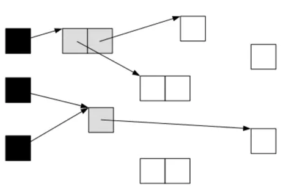

# G1垃圾收集器

G1将堆分成相同大小的Region区域，逻辑上还是存在Survivor、Edon、Old、Humongous（存放大对象），这样便于复用之前分代框架的逻辑。这些区域在物理上不要求连续。这带来的额外的好处——有的分区垃圾多、有的分区少，G1会优先回收价值收益最大的那些Region ，这也是G1名称的由来。

## 优点

- 可以解决CMS 从currency Mode Failed的问题
- 收集的最小单位是Region，也就是每次回收整数倍的Region，而不是整个堆，这样缩短了GC的停顿时间
- 进行垃圾回收的时候已经完成了内存压缩，降低了内存碎片的生成
- 在堆内存较大的时候表现出比较高的吞吐量和短暂的暂停
- Eden、Survivor、Old区域不再固定，在内存使用效率上来说更灵活

## 使用场景

- 想要更可控、可预期的GC停顿周期；防止高并发下应用雪崩
- 服务端多核CPU，JVM内存占用比较大的应用
- 运行过程中会产生内存碎片，需要经常压缩空间

## 概念

- 收集集合（**CSet**）
  - 一组可以被回收的分区的集合
  - 在CSet中存活的数据会在GC过程中移动到另一个可用分区，CSet中的分区可以来自年轻代、老年代。
  - CSet会占用不到整个堆空间1%大小
- 已记忆集合（**RSet**）
  - 记录了其他Region的对象引用本Region中对象的关系
  - 作用：使得垃圾收集器不用扫描整个堆找到谁引用了当前分区的对象，只需要扫描`RSet`即可

## 原理

- 将堆划分成多个相同的Region（大小可以指定`-XX:G1HeapRegionSize`，不指定时JVM会自动计算）；Region逻辑上连续，物理上内存地址不要求连续
- 每个Region被标记为`E（Eden）`、`S（Survivor）`、`O（Old）`、`H（Humongous）`；其中`E`、`S`属于年轻代，`O`、`H`属于老年代
- 
- 其中`H`表示巨型对象；当分配的对象>=Region的一半时就会被认为是巨型对象；当分配的对象>Region时就会被认为是超级巨型对象，会分配在多个连续的`H`区域；`H`默认分配在老年代，可以防止GC时巨型对象的内存拷贝
- 空白的区域不属于任何一个分区，G1可以在需要的时候指定这个分区属于哪个分类

### 跨代引用处理

- 问题由来
  - 进行Yong GC时，Yong区的对象可能还存在Old区的引用，这就是跨代引用的问题
- 如何解决
  - 为了解决Yong GC时，扫描整个老年代，G1引入了`Card Table`和`Remember Set`概念，基本思想就是用空间换时间
    - Rset（Remember Set）：用来记录外部指向本Region的所有引用，每个`Region` 维护一个 `RSet`
    - Card：JVM将Region划分成固定大小的`Card`，可以类比物理内存上的page概念
    - 
    - 这两个数据结构专门用来处理跨Region的引用

### SATB（Snapshot At the Beginning）

**含义**

- 在开始GC前存活对象的快照
  - 这一阶段之后有些对象可能会变成垃圾、这就是浮动垃圾（floating garbage）

**作用**

- 保证并发标记阶段的正确性

**在垃圾回收器执行期间，引用可能会发生变化**，G1通过写前屏障来解决这个问题

- 并发标记阶段，当引用关系发生变化，写前屏障内部会调用`pre-write barrier`函数把这种变化记录并保存到一个队列中，叫做`satb_mark_queue`
- 在`remark`(重新标记阶段)，旧的引用所指向的对象会被标记上，其子孙也会被递归标记上，这样就不会遗漏任何对象，snapshot快照的完整性也得到了保证
  - 某些对象可能已经是垃圾了，但是SATB会让它们活过这次GC，这就是`浮动垃圾`（`Floating garbage`），像这样的对象只能等到下一次收集回收掉

### 三色标记法

- 黑色：表示对象已经被垃圾收集器访问过，且这个对象的所有引用都已经扫描过了
- 灰色：表示对象已经被垃圾收集器访问过，但是这个对象至少还存在一个引用还没有被扫描过
- 白色：表示对象尚未被垃圾收集器访问过，显然在可达性分析开始阶段，所有的对象都是白色的；扫描完成所有对象之后，最终为白色的对象，即代表不可达、垃圾对象

### GC过程中新创建的对象

**在GC过程中新创建的对象都是活的，其他不可达的对象就是死的**

如何知道GC开始之后新分配的对象

- 在Region中通过`top-at-mark-start(TAMS)`指针，分别是`prevTAMS`和`nextTAMS`
- 
- 在TAMS指针以上的对象就是新分配的，因而被隐士标记（marked）
  - G1的`concurrent marking`用了两个`指针(bitmap)`：一个prevTAMS记录第n-1轮concurrent marking所得的对象存活状态；由于第n-1轮concurrent marking 已经完成，这个bitmap（`prevTAMS`）可以直接使用；一个nextTAMS记录第n轮concurrent marking的结果。这个bitmap（`nextTAMS`）是当前将要或正在进行的concurrent marking结果，尚未完成，所以还不能使用。
  - 其中`top`是该`Region`的当前分配指针位置，[bottom, top)是当前该region已用（used）的部分，[top, end)是尚未使用的可分配空间（unused）
    - [bottom, prevTAMS)： 这部分里的对象存活信息可以通过prevBitmap来得知
    - [prevTAMS, nextTAMS)：这部分里的对象在第n-1轮concurrent marking是隐式存活的
    - [nextTAMS, top)：这部分里的对象在第n轮concurrent marking是隐式存活的

## GC流程

G1的GC有三种：

- Yong GC
- Mixed GC（混合GC）
- Full GC

下面分别介绍

### Yong GC

- 在`E（Eden）`区域充满时触发
- 回收所有年轻代的Region
- `E（Eden）`区的对象会移动到`S（Survivor）`区，当`S（Survivor）`区空间不足时，`E（Eden）`区的对象会直接晋升到`O（Old）`区，同时`S（Survivor）`区的对象会移动到新的`S（Survivor）`区域，如果`S（Survivor）`区的部分对象达到一定年龄，会晋升到`O（Old）`区
- 

### Mixed GC

**混合GC**、回收所有年轻代的Region + 部分老年代的Region

- 部分老年代由参数 -XX:MaxGCPauseMills 控制，即G1收集的暂停时间，默认200ms，当然这只是一个期望值
- `XX:InitiatingHeapOccupancyPercent`老年代占据整个堆大小的百分比，默认是`45%`，达到该阈值就会触发一次Mixed GC

GC流程：分为两个阶段：全局并发标记 和 拷贝存活对象

- 全局并发标记（global concurrent marking）
  - 初始标记（initial mark，STW）：它标记了从 GC Root开始直接可达的对象。初始标记阶段借用了Yong GC的暂停，因而没有额外的、单独的暂停阶段，但是会增加Yong GC处理时间和CPU消耗。
  - 根分区扫描（root-region-scan）：这个过程不需要暂停应用，在初始标记或者新生代收集中被拷贝到`S（Survivor）`区的对象，都需要被看作根。这个阶段G1开始扫描`S（Survivor）`分区，所有被`S（Survivor）`分区所引用的对象都会被扫描到并将被标记。`S（Survivor）`分区就是根分区，正因为这个，该阶段不能发生新生代收集，如果扫描根分区时，新生代的空间恰好用尽，新生代垃圾收集器必须等待根分区扫描结束才能完成。**如果在日志中发现根分区扫描和新生代收集的日志交替出现，就说明当前应用需要调优**。
  - 并发标记（concurrent marking）：整个阶段从GC Root开始对heap中的对象标记、标记线程与应用线程并行执行，并记录收集各`Regin`中存活的对象信息。这个过程还会扫描上文中提到的SATB write所记录下的引用（全局引用列表，`satb_mark_queue`缓存区域满了之后会放到这里）
  - 最终标记（remark，STW）：标记那些在并发阶段发生变化的对象，扫描剩下的`satb_mark_queue`
  - 清除垃圾（Cleanup，部分STW）：这个阶段如果发现完全没有活对象的Region，就会将其整体回收到可分配的Region列表中，清空Region。清理阶段真正回收的内存很小，截止到这个阶段，G1垃圾收集器主要是标记哪些老年代分区可以回收，将老年代按照它们的存活度从小到大排列。这个阶段还会做几个事情：
    - 识别空闲的空间
    - Rset（Remember Set）梳理
    - 将不用的类从metaspace中卸载
    - 回收巨型对象
      - 在JDK8u40之前，巨型对象的回收只能在并发收集周期的清除阶段或FULL GC过程中过程中被回收
      - 在JDK8u40（包括这个版本）之后，一旦没有任何其他对象引用巨型对象，那么巨型对象也可以在年轻代收集中被回收
    - -
    - 识别出每个分区里存活的对象有个好处是在遇到一个完全空闲的分区时，它的RSet可以立即被清理，同时这个分区可以立刻被回收并释放到空闲队列中，而不需要再放入CSet等待混合收集阶段回收；梳理RSet有助于发现无用的引用
- 拷贝存活对象（Evacuation，STW）
  - 负责把一部分Region里活对象拷贝到空的Region中（并行拷贝），然后回收原来的Region
  - 可以自由选择多个region来独立收集构建成收集集合（collection set，CSet），CSet集合中Regin的选定依赖于上下文中提到的停顿模型，该阶段并不会拷贝所有有活对象的region，只是选择收益高的少量region来拷贝（垃圾对象比较多的），这使得停顿的开销可控
  - 

### Full GC

- G1的垃圾收集过程是和应用程序并发执行的，当Mixed GC的速度赶不上应用程序申请内存的速度的时候，Mixed GC就会降级到Full GC。Full GC会导致长时间的STW，应该要尽量避免。
  - `拷贝存活对象（evacuation）`阶段没有足够的to-space来存放晋升的对象
  - 并发处理过程完成之前空间耗尽
- G1 和 CMS的Full GC是单线程的`mark sweep compact (标记 清除 整理)`算法，JDK 10进行了优化，改成了多线程方式（合并了Shenandoah的代码  ）

