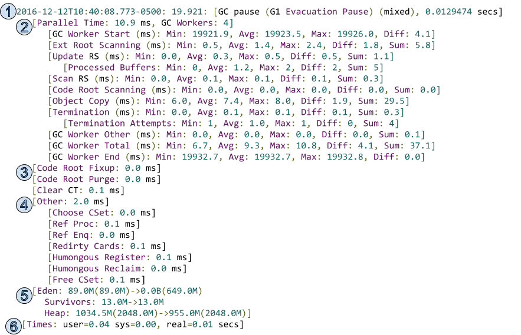

# 日志

JVM中包含好几个垃圾垃圾收集器，包括：Serial、ParNew、Parallel Scavenge、Serial Old、Parallel Old、CMS、G1，它们的日志输出格式会有些差别，下面详细说明集中场景的组合

## Serial

``` reStructuredText
32.790: [GC (Allocation Failure) 32.790: [DefNew: 77535K->1323K(78656K), 0.0047412 secs] 121038K->45264K(253440K), 0.0048165 secs] [Times: user=0.00 sys=0.00, real=0.01 secs] 

33.080: [Full GC (Metadata GC Threshold) 33.080: [Tenured: 43940K->24853K(174784K), 0.0738138 secs] 89886K->24853K(253440K), [Metaspace: 20760K->20760K(1069056K)], 0.0739382 secs] [Times: user=0.06 sys=0.00, real=0.07 secs] 
```

1. 32.790 / 33.080 : GC事件启动的时间，相对于JVM启动时间。以秒（s）为单位
2. GC (Allocation Failure) / Full GC (Metadata GC Threshold) : GC类别（Minor & Full GC）和原因
3. DefNew / Tenured 垃圾收集器名称，分别代表 Serial / Serial Old GC
4. 77535K->1323K(78656K) | 43940K->24853K(174784K) | 20760K->20760K(1069056K) 年轻代/老年代/元空间GC前后大小
5. (78656K) | (174784K) | (1069056K) 年轻代/老年代/元空间的总大小
6. 121038K->45264K | 89886K->24853K : GC 前后整个堆的大小
7. (253440K) | (253440K) 总可用堆大小
8. 0.0048165 secs | 0.0738138 secs | 0.0739382 secs : GC持续时间
9. [Times: user=0.00 sys=0.00, real=0.01 secs] - GC持续时间，按照不同类别来衡量
   - user - 用户模式代码（内核外部）花费的CPU时间
   - sys - 操作系统调用或等待系统事件所花费的时间
   - real - 实际GC时间。由于Serial是单线程的，所有 real = user + sys

## Parallel Scavenge + Parallel Old

``` reStructuredText
14.566: [GC (Allocation Failure) [PSYoungGen: 693750K->46590K(702464K)] 761832K->138136K(877568K), 0.0473548 secs] [Times: user=0.09 sys=0.00, real=0.05 secs] 

15.378: [GC (Metadata GC Threshold) [PSYoungGen: 208518K->3925K(1110528K)] 300064K->97653K(1285632K), 0.0062363 secs] [Times: user=0.03 sys=0.00, real=0.01 secs] 

15.384: [Full GC (Metadata GC Threshold) [PSYoungGen: 3925K->0K(1110528K)] [ParOldGen: 93727K->18389K(115712K)] 97653K->18389K(1226240K), [Metaspace: 20688K->20688K(1069056K)], 0.0379035 secs] [Times: user=0.08 sys=0.00, real=0.04 secs] 
```

和上面的Serial基本类似，其中PSYoungGen、ParOldGen分别代表Parallel Scavenge、Parallel Old

## ParNew + CMS

``` reStructuredText
45.261: [GC (Allocation Failure) 45.261: [ParNew: 76473K->5414K(78656K), 0.0052505 secs] 120293K->51353K(253440K), 0.0053349 secs] [Times: user=0.00 sys=0.00, real=0.01 secs] 

45.680: [GC (Allocation Failure) 45.680: [ParNew: 75366K->8703K(78656K), 0.0064204 secs] 121305K->54835K(253440K), 0.0065176 secs] [Times: user=0.06 sys=0.00, real=0.01 secs] 

45.687: [GC (CMS Initial Mark) [1 CMS-initial-mark: 46131K(174784K)] 54916K(253440K), 0.0025091 secs] [Times: user=0.00 sys=0.00, real=0.00 secs] 
45.689: [CMS-concurrent-mark-start]
45.745: [CMS-concurrent-mark: 0.056/0.056 secs] [Times: user=0.16 sys=0.01, real=0.06 secs] 
45.745: [CMS-concurrent-preclean-start]
45.747: [CMS-concurrent-preclean: 0.001/0.001 secs] [Times: user=0.00 sys=0.00, real=0.00 secs] 
45.747: [CMS-concurrent-abortable-preclean-start]
46.164: [CMS-concurrent-abortable-preclean: 0.259/0.417 secs] [Times: user=1.31 sys=0.05, real=0.42 secs] 
46.164: [GC (CMS Final Remark) [YG occupancy: 48396 K (78656 K)]46.164: [Rescan (parallel) , 0.0101891 secs]46.174: [weak refs processing, 0.0000292 secs]46.174: [class unloading, 0.0085192 secs]46.183: [scrub symbol table, 0.0122679 secs]46.195: [scrub string table, 0.0007198 secs][1 CMS-remark: 46131K(174784K)] 94528K(253440K), 0.0324409 secs] [Times: user=0.09 sys=0.00, real=0.03 secs] 
46.197: [CMS-concurrent-sweep-start]
46.209: [CMS-concurrent-sweep: 0.012/0.012 secs] [Times: user=0.00 sys=0.00, real=0.01 secs] 
46.209: [CMS-concurrent-reset-start]
46.212: [CMS-concurrent-reset: 0.004/0.004 secs] [Times: user=0.05 sys=0.02, real=0.00 secs] 

46.337: [GC (Allocation Failure) 46.337: [ParNew: 78655K->6105K(78656K), 0.0062528 secs] 123255K->53901K(253440K), 0.0063434 secs] [Times: user=0.00 sys=0.00, real=0.01 secs] 

46.680: [GC (Allocation Failure) 46.680: [ParNew: 76057K->3477K(78656K), 0.0056138 secs] 123853K->52917K(253440K), 0.0057093 secs] [Times: user=0.06 sys=0.00, real=0.01 secs] 
```

1. CMS-initial-mark 初始标记阶段，46131K(174784K) : 老年代容量174784K，使用了46131K
2. CMS-concurrent-mark-start 并发标记，与用户线程并发执行，过程耗时很长。目的：从GC Root开始对堆中对象进行可达性分析，找出存活对象
3. CMS-concurrent-mark: 0.056/0.056 secs 并发标记阶段花费了0.056 secs
4. CMS-concurrent-preclean-start 并发预清理阶段，也是与用户线程并发执行。虚拟机查找在执行并发标记阶段新进入老年代的对象(可能会有一些对象从新生代晋升到老年代， 或者有一些对象被分配到老年代)。通过重新扫描，减少下一个阶段”重新标记”的工作，因为下一个阶段会Stop The World。
5. CMS-concurrent-preclean: 0.001/0.001 secs 并发预清理耗时
6. [CMS-concurrent-abortable-preclean-start] [CMS-concurrent-abortable-preclean: 0.259/0.417 secs] [Times: user=1.31 sys=0.05, real=0.42 secs]  并发可中止预清理阶段，运行在并行预清理和重新标记之间，直到获得所期望的eden空间占用率。增加这个阶段是为了避免在重新标记阶段后紧跟着发生一次垃圾清除。为了尽可能区分开垃圾清除和重新标记 ，我们尽量安排在两次垃圾清除之间运行重新标记阶段。
7. [GC (CMS Final Remark) [YG occupancy: 48396 K (78656 K)]46.164: [Rescan (parallel) , 0.0101891 secs]46.174: [weak refs processing, 0.0000292 secs]46.174: [class unloading, 0.0085192 secs]46.183: [scrub symbol table, 0.0122679 secs]46.195: scrub string table, 0.0007198 secs 1 CMS-remark: 46131K(174784K)] 94528K(253440K), 0.0324409 secs] [Times: user=0.09 sys=0.00, real=0.03 secs]  重新标记阶段，会暂停所有用户线程。该阶段完成标记整个年老代的所有存活对象。
   1. GC (CMS Final Remark) - 收集阶段，这个阶段会标记年老代全部的存活对象，包括在并发标记阶段更改的或者新创建的引用对象
   2. [YG occupancy: 48396 K (78656 K)] 年轻代当前占用情况和容量
   3. [Rescan (parallel) , 0.0101891 secs]重新标记所花的时间
   4. [weak refs processing, 0.0000292 secs] 处理弱引用耗时
   5.  [class unloading, 0.0085192 secs] 卸载无用class耗时
   6. scrub string table / scrub symbol table  that is cleaning up symbol and string tables which hold class-level metadata and internalized string respectively
   7. 46131K(174784K)] 这个阶段之后老年代占有的内存大小和老年代容量
   8.  94528K(253440K) 这个阶段之后整个堆的大小和容量
   9.  0.0324409 secs 这个阶段的持续时间
8. CMS-concurrent-sweep-start 并发清理开始
9. [CMS-concurrent-sweep: 0.012/0.012 secs] [Times: user=0.00 sys=0.00, real=0.01 secs] 并发清理结束，所用时间
10. CMS-concurrent-reset-start 开始并发重置
11. [CMS-concurrent-reset: 0.004/0.004 secs] [Times: user=0.05 sys=0.02, real=0.00 secs] 并发重置耗时

## G1日志分析（jdk 8）

### Yong GC

``` reStructuredText
// 程序运行1.042s后发生GC（Evacuation Pause） (可以通过添加JVM参数-XX:+PrintGCDateStamps打印发生gc日志的详细时间)
// Yong GC
1.042: [GC pause (G1 Evacuation Pause) (young), 0.0044119 secs]
   // 并行GC耗时3.0 ms，GC线程数4个
   [Parallel Time: 3.0 ms, GC Workers: 4]
      // 所有工作线程启动时间的最小值、平均值、最大值、差别
      [GC Worker Start (ms): Min: 1042.5, Avg: 1042.5, Max: 1042.5, Diff: 0.0]
      // 每个扫描root线程的耗时
      [Ext Root Scanning (ms): Min: 0.5, Avg: 0.7, Max: 1.0, Diff: 0.5, Sum: 2.8]
      // 每个执行更新RS（Remembered Sets）的线程的耗时最小值、平均值、最大值、差别
      [Update RS (ms): Min: 0.0, Avg: 0.0, Max: 0.0, Diff: 0.0, Sum: 0.0]
      	 // 每个工作线程执行UB（Update Buffers）的数量的最小值、平均值、最大值、差别
         [Processed Buffers: Min: 0, Avg: 0.0, Max: 0, Diff: 0, Sum: 0]
      // 每个工作线程扫描RSet的耗时统计数据
      [Scan RS (ms): Min: 0.0, Avg: 0.0, Max: 0.0, Diff: 0.0, Sum: 0.0]
      // 扫描code root耗时。Code Root是JIT编译后的代码里引用了heap中的对象
      [Code Root Scanning (ms): Min: 0.0, Avg: 0.1, Max: 0.2, Diff: 0.2, Sum: 0.3]
      // 每个工作线程执行OC（Object Copy）的耗时统计数据（拷贝存活对象到新的Region）
      [Object Copy (ms): Min: 1.9, Avg: 2.1, Max: 2.3, Diff: 0.5, Sum: 8.4]
      // 每个工作线程执行终止的耗时统计数据
      [Termination (ms): Min: 0.0, Avg: 0.0, Max: 0.0, Diff: 0.0, Sum: 0.0]
      	 // 每个工作线程执行终止的重试的次数的统计数据
         [Termination Attempts: Min: 1, Avg: 10.5, Max: 21, Diff: 20, Sum: 42]
      // 每个工作线程执行其他任务（上述未统计的内容）的耗时的统计信息
      [GC Worker Other (ms): Min: 0.0, Avg: 0.0, Max: 0.0, Diff: 0.0, Sum: 0.1]
      [GC Worker Total (ms): Min: 2.9, Avg: 2.9, Max: 2.9, Diff: 0.0, Sum: 11.7]
      [GC Worker End (ms): Min: 1045.4, Avg: 1045.4, Max: 1045.4, Diff: 0.0]
   // ===================== 串行任务 ============================
   // 修复GC期间code root指针改变的耗时
   [Code Root Fixup: 0.0 ms]
   // 清除code root耗时
   [Code Root Purge: 0.0 ms]
   // 清理CT（Card Table）中的dirty card的耗时
   [Clear CT: 0.0 ms]
   // 其他任务（上述未统计的内容）的耗时
   [Other: 1.4 ms]
   	  // 选择分区耗时
      [Choose CSet: 0.0 ms]
      // 执行关联（Reference objects）的耗时
      [Ref Proc: 1.0 ms]
      // 将references放入ReferenceQueues的耗时
      [Ref Enq: 0.0 ms]
      [Redirty Cards: 0.3 ms]
      [Humongous Register: 0.0 ms]
      [Humongous Reclaim: 0.0 ms]
      // 释放CS（collection set）的耗时
      [Free CSet: 0.0 ms]
   // Eden容量为14M，使用了14M，GC后变为0，容量目标大小增加到16M
   // SurvivorsGC前为0，GC后变为2048K
   // GC前，Heap容量为256M，使用了14M，GC后，Heap容量为256M，使用了3683.5K
   [Eden: 14.0M(14.0M)->0.0B(16.0M) Survivors: 0.0B->2048.0K Heap: 14.0M(256.0M)->3683.5K(256.0M)]
 // user=0.00 在垃圾回收时，执行用户态代码所消耗的处理器时间， 这个时间包含了所有线程运行的CPU时间，所以比real大很多
 // sys=0.00: 执行核心态代码所耗费的处理器时间
 // real=0.03: 垃圾回收从开始到结束耗费的时钟时间，也就是整体上的GC耗费时间
 [Times: user=0.00 sys=0.00, real=0.00 secs]
```

### 并发标记日志

```reStructuredText
// 利用STW停顿期间，跟踪所有可达对象，该阶段与Yong GC一起执行。同时该阶段也设置两个指针TAMS来标识已经存在的对象以及在并发标记阶段新生成的对象
16.755: [GC pause (G1 Evacuation Pause) (young) (initial-mark), 0.0690397 secs]
   // 并行任务花费的STW的时间，从收集开始到最后一个GC线程结束；GC Worker：并行收集线程数
   [Parallel Time: 48.0 ms, GC Workers: 4]
      [GC Worker Start (ms): Min: 16756.0, Avg: 16756.0, Max: 16756.1, Diff: 0.1]
      [Ext Root Scanning (ms): Min: 6.0, Avg: 7.0, Max: 8.3, Diff: 2.3, Sum: 28.0]
      [Update RS (ms): Min: 1.1, Avg: 1.3, Max: 1.8, Diff: 0.8, Sum: 5.2]
         [Processed Buffers: Min: 3, Avg: 4.5, Max: 8, Diff: 5, Sum: 18]
      [Scan RS (ms): Min: 0.4, Avg: 0.6, Max: 0.8, Diff: 0.4, Sum: 2.4]
      [Code Root Scanning (ms): Min: 0.8, Avg: 1.5, Max: 2.4, Diff: 1.6, Sum: 6.0]
      [Object Copy (ms): Min: 35.4, Avg: 37.3, Max: 38.8, Diff: 3.5, Sum: 149.0]
      [Termination (ms): Min: 0.0, Avg: 0.0, Max: 0.0, Diff: 0.0, Sum: 0.1]
      [GC Worker Other (ms): Min: 0.1, Avg: 0.1, Max: 0.2, Diff: 0.1, Sum: 0.5]
      [GC Worker Total (ms): Min: 47.7, Avg: 47.8, Max: 47.9, Diff: 0.1, Sum: 191.2]
      [GC Worker End (ms): Min: 16803.8, Avg: 16803.8, Max: 16803.9, Diff: 0.1]
   [Code Root Fixup: 1.2 ms]
   [Code Root Purge: 0.1 ms]
   [Clear CT: 0.5 ms]
   [Other: 19.1 ms]
      [Choose CSet: 0.0 ms]
      [Ref Proc: 15.9 ms]
      [Ref Enq: 0.2 ms]
      [Redirty Cards: 0.2 ms]
      [Humongous Reclaim: 0.0 ms]
      [Free CSet: 1.9 ms]
   [Eden: 1205.0M(1205.0M)->0.0B(1183.0M) Survivors: 23.0M->45.0M Heap: 1242.2M(2048.0M)->59.2M(2048.0M)]
 [Times: user=0.18 sys=0.03, real=0.07 secs]
// 扫描初始标记阶段：扫描Survivor区和Root Region并标记出来
16.825: [GC concurrent-root-region-scan-start]
16.862: [GC concurrent-root-region-scan-end, 0.0372516 secs]
// 并发标记阶段：该阶段和应用线程一起执行，并发线程数默认是并行线程数的四分之一。可以通过-XX:ConcGCThreads显示指定
16.862: [GC concurrent-mark-start]
16.895: [GC concurrent-mark-end, 0.0329025 secs]
// 重新标记阶段：STW，标记那些在并发标记阶段发生变化的对象
16.895: [GC remark 16.895: [Finalize Marking, 0.0015935 secs] 16.897: [GC ref-proc, 0.0008752 secs] 16.898: [Unloading, 0.0176835 secs], 0.0209333 secs]
 [Times: user=0.06 sys=0.00, real=0.02 secs]
// 清理垃圾阶段 Cleanup：也是STW，这个阶段没有存活对象的Old Region 和 Humongous Region将被释放和清空
// 为了准备下次GC，在CSets中的Old Regions会根据他们的回收收益的大小排序，
// previous bitmaps 和 next bitmaps会被交换
// 同时并行线程会标记那些inital mark阶段生成的对象，以及至少存在一个存活对象的region的bitmap
16.916: [GC cleanup 76M->76M(2048M), 0.0024148 secs]
 [Times: user=0.00 sys=0.00, real=0.00 secs]
```

### Mixed GC



`Mixed GC`的日志和`Yong GC`日志很像，只有下面的几点不同

- 第一行表示这是一个Mixed GC
- 收集的集合里包含了老年代（Old Region）,由并发标记阶段确定的

### Full GC


``` reStructuredText
9739.946: [Full GC (Heap Dump Initiated GC)  585M->116M(2048M), 0.8014562 secs]
   [Eden: 342.0M(1199.0M)->0.0B(1228.0M) Survivors: 29.0M->0.0B Heap: 585.2M(2048.0M)->116.2M(2048.0M)], [Metaspace: 107516K->105667K(1150976K)]
 [Times: user=0.94 sys=0.00, real=0.80 secs]

9949.841: [Full GC (Heap Inspection Initiated GC)  205M->115M(2048M), 0.4896575 secs]
   [Eden: 90.0M(1228.0M)->0.0B(1228.0M) Survivors: 0.0B->0.0B Heap: 205.8M(2048.0M)->115.5M(2048.0M)], [Metaspace: 105667K->105667K(1150976K)]
 [Times: user=0.63 sys=0.00, real=0.49 secs]
```


G1的垃圾收集器是和应用程序并发执行的，当Mixed GC的速度赶不上应用程序申请内存的速度的时候，Mixed GC就会降级到Full GC，使用的是Serial GC。Full GC会导致长时间的STW，应该要尽量避免。

触发条件

- 拷贝存活对象（Evacuation）没有足够的to-space 来存放晋升的对象
- 并发处理过程完成之前空间耗尽
- 手动触发Full GC（System.gc() 或 通过 jmap 工具）

注意事项

- 如果是几天一次Full GC，则是正常现象，但是每小时频繁GC就需要调优了

## 参考链接

[jdk 1.8 G1 GC 日志](https://www.jianshu.com/p/ac1ba3479c08)

 