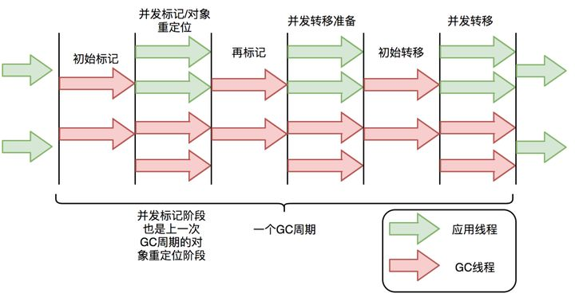
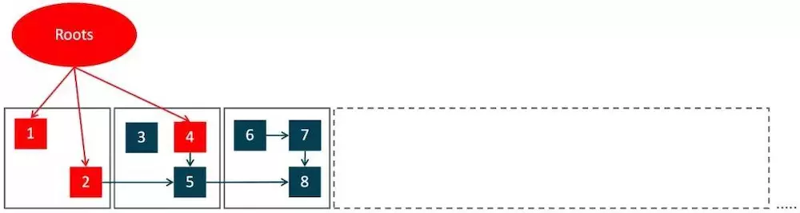
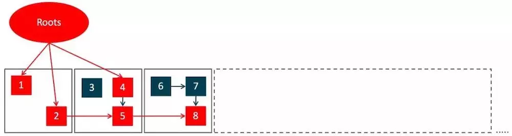
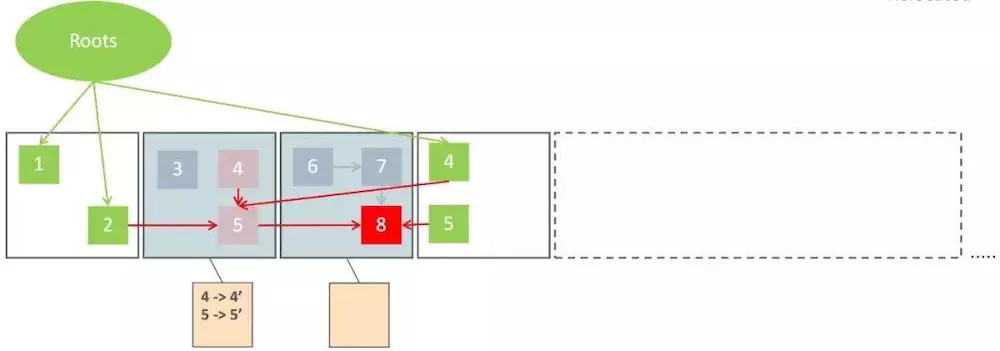

# ZGC

> ZGC是一个低延迟的GC算法，最大的暂停时间只有几毫秒，并且暂停时间不随着管理的堆内存增大而增大，可以处理8MB-16TB的堆

## 特点

1. 支持大堆，最大4TB，后续增加到了16TB
2. 回收的最小单位也是Region，但是Region的大小不固定
3. 没有分代
4. 使用着色指针技术，利用高位存储额外的数据信息
5. 没有专门的数据结构来存储跨Region之间的引用（因为ZGC划分Region并不是为了增量回收，每次都会对所有Region进行回收，而且ZGC暂时没有实现分代回收）

## 回收流程

## 主要的回收过程

1. 初始标记
   1. STW。通常改阶段耗时很短
   2. 和其他垃圾收集器类似，标记所以GC Root
   3. 
2. 并发标记
   1. 从GC Root开始可达性分析，并发地标记其他存活的对象
   2. 
3. 再标记
   1. STW，停顿时间很短，最多1ms，超过1ms再次进入并发标记
   2. 标记并发标记期间引用地址变化的对象
4. 并发转移准备
5. 初始转移
6. 并发转移
   1. 清理Region，将存活的对象移动到新的Region，并记录这种转向
   2. 
   3. 通过着色指针和读屏障技术，实现并发转移
7. 修正指针
   1. 修复整个堆旧的引用地址，需要扫描整个堆，而并发标记阶段也需要扫描整个堆，所以这个阶段会合并到下一次GC的并发标记阶段

