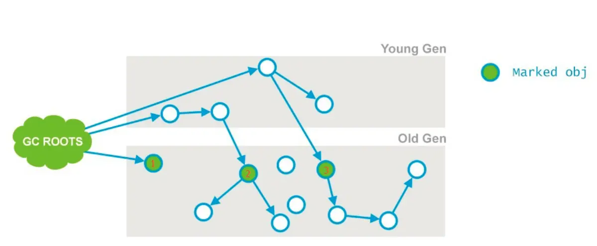

# JVM垃圾收集器

## 概述

垃圾收集器是垃圾回收算法（标记—清除算法、复制算法、标记—整理算法、火车算法）的具体实现，不同厂商、不同版本的jvm所提供的垃圾收集器可能会存在差异，下面介绍hotspot虚拟机中常用的垃圾收集器

### 垃圾收集器组合

JDK7/8后，HotSpot虚拟机所有垃圾收集器组合如下：

- 图中展示了7中不同的垃圾收集器
  - Serial、ParNew、Parallel Scavenge、CMS、Serial Old（MSC）、Parallel Old、G1
- 图中展示了各种GC算法作用的分代
  - 新生代：Serial、ParNew、Parallel Scavenge
  - 老年代：CMS、Serial Old、Parallel Old
  - 整体收集器：G1
- 两个垃圾收集器之间有连线表示可以搭配使用
  - Serial GC + Serial Old GC
    - -XX:+UseSerialGC
  - Serial GC + CMS
    - -XX:+UseConcMarkSweepGC -XX:-UseParNewGC
  - ParNew + CMS
    - -XX:+UseConcMarkSweepGC
  - ParNew + Serial Old
    - -XX:+UseParNewGC
  - Parallel Scavenge + Serial Old
    - -XX:+UseParallelGC + -XX:-UseParallelOldGC
  - Parallel Scavenge + Parallel Old (-server模式下默认)
    - -XX:+UseParallelGC
  - G1GC
    - -XX:+UseG1GC
- 其中Serial Old作为CMS出现"Concurrent Mode Failure"失败的后备方案

### 并发和并行垃圾收集器的区别

这里借用了程序执行上的并行并发的相关概念（程序执行上，**并发是在一段时间内宏观上多个程序同时运行，并行是在某一时刻，真正有多个程序在运行**），指用户线程和垃圾回收线程之间的关系

#### 并行收集器

指多条垃圾收集线程并行工作，但是此时用户线程仍然处于等待状态

#### 并发收集器

用户线程与垃圾收集器线程同时执行（但不一定是并发的，可能交替执行）；

用户线程继续执行，而垃圾收集程序运行于另一个CPU上

如CMS、G1

### Mini GC 和 Full GC

- Minor GC 新生代GC，指发生在新生代的GC
- Full GC major GC或老年代GC，指发生在老年代的GC

## Serial 收集器

Serial（串行）垃圾收集器是最基本、发展历史最悠久的收集器

#### 特点：

- 针对新生代
- 采用复制算法
- 单线程收集
- 进行垃圾收集时，必须暂停所有工作线程，直到完成；即会"stop the world"

#### 应用场景：

依然是HotSpot在client模式下默认的新生代收集器

也有优于其他收集器的地方

​	简单高效（与其他收集器相比）

​	没有线程交互（切换）的开销

## ParNew收集器

ParNew垃圾收集器是Serial收集器的多线程版本

### 特点

- 除了多线程，其余行为、特点和Serial收集器一样
- 和Serial收集器可用控制参数类似

### 应用场景

可以和CMS垃圾回收器配合使用

## Parallel Scavenge

Parallel Scavenge垃圾收集器和吞吐量有关，也称为吞吐量收集器（Throughput Collector）

### 特点

- 达到一个可控的吞吐量

### 应用场景

- 高吞吐量为目标，即减少垃圾收集时间，让用户代码获得更长的运行时间
- 应用程序运行在多核CPU上，对暂停时间没有特别高的要求，即程序主要在后台进行计算，而不需要与用户进行太多的交互

### 设置参数

- -XX:MaxGCPauseMillis 控制最大垃圾收集器停顿时间
  - 这个参数G1也用到了，代表了收集的最大暂停时间，这是一个期望值
  - 设置的稍小，停顿时间可能会缩短，但也可能会使得吞吐量下降，因为可能会导致垃圾收集发生的更频繁
- -XX:GCTimeRatio=n设置垃圾收集时间占总时间的比率，0<n<100的整数
  - `GCTimeRatio`相当于设置吞吐量大小；垃圾收集执行时间占应用程序执行时间的比例的计算方法是： 1 / (1 + n) 。例如，选项`-XX:GCTimeRatio=19`，设置了垃圾收集时间占总时间的5%==1/(1+19)；默认值是1%==1/(1+99)，即n=99；
- -XX:+UseAdaptiveSizePolicy
  - 自适应大小策略，jdk8默认开启。开启后，则每次 GC 后会重新计算 Eden、From 和 To 区的大小；JVM会根据当前系统运行情况收集性能监控信息，动态调整这些参数，以提供最合适的停顿时间或最大的吞吐量，这是GC自适应的调节策略（GC Ergonomiscs）的一部分。

### 吞吐量和收集器关注点说明

#### 吞吐量

CPU运行用户代码的时间与CPU总耗时的比值

**吞吐量=运行用户代码的时间 /（运行用户代码的时间+垃圾收集时间）**

高吞吐量即减少垃圾收集的时间。让用户代码获得更长的运行时间

#### 垃圾收集器期望的目标（关注点）

- 停顿时间

  停顿时间越短就越适合与用户交互

- 吞吐量

  高吞吐量则可以高效地利用CPU时间，尽快完成运算任务

  主要适合在后台计算而不需要太多交互的任务

- 覆盖区

  在达到前面两个目标的情况下，尽量减少堆的内存空间

  可以获得更好的空间局部性

## Serial Old收集器

Serial Old是 Serial收集器的老年代版本

### 特点

- 针对老年代
- 采用“标记-整理”算法（还要压缩，Mark-Sweep-Compact）
- 单线程收集

## Paralel Old收集器

Parallel Old垃圾收集器是Parallel Scavenge收集器的老年代版本

### 特点

- 针对老年代
- 采用“标记-整理”算法
- 多线程收集

### 应用场景

- 用来替代老年代的Serial Old收集器
- Server模式，多CPU的情况下

## CMS 收集器

并发标记清理收集器

### 特点：

- 针对老年代
- 基于“标记-清除”算法（不进行压缩操作，会产生内存碎片）
- 以获取最短回收停顿时间为目标
- 并发收集、低停顿
- 需要更多的内存

### 应用场景

- 与用户交互较多的场景
- 希望系统停顿时间最短，注意服务的响应速度
- 已给用户带来最好的体验
- 如常见web、B/S系统的服务器上的应用

## 流程图

### 运作流程

1. 初始标记（CMS initial mark）

   - 标记从GC Root直接可达的老年代对象、
   - 新生代直接引用的老年代对象
   - 
   - STW（Stop The World）
   - 这个过程JDK7之前是单线程的，JDK8之后并行

2. 并发标记（CMS concurrent mark）

   - 由上一阶段标记过的对象，开始tracing过程，标记所有可达的对象
   - 这个阶段垃圾回收线程和用户线程并行执行，有些老年代对象的引用发生了变化，这些受到影响的老年代对象所在的card会被标记为dirty，用于重新标记阶段扫描
   - ****
   - 并不能保证可以标记出所有的存活对象
   - 可能会导致**concurrent mode failure**

3. 预清理阶段（CMS pre cleaning）

   - 处理并发标记阶段被应用线程影响到的老年代对象，包括
     - 老年代中Card为dirty的区域
     - 年轻代中引用到的老年代对象

4. 可终止的预清理

   - 这个阶段和“预清理”阶段相同，为了减轻重新标记的工作量。这个阶段持续的时间依赖好多的因素，由于这个阶段是重复的做相同的事情直到发生abort的条件（比如：重复的次数、多少量的工作、持续的时间等等）之一才会停止
     - 尽量等到一次Minor GC，尽可能缩短重新标记的停顿时间

5. 重新标记

   - 完成标记整个年老代的所有的存活对象
   - STW
   
6. 并发清除

   - 用户线程被激活，同时将那些未被标记为存活的对象标记为不可达

7. 并发重置

   - CMS内部重置回收器状态、准备进入下一个并发回收周期

### 使用CMS需要注意的问题

- 减少重新标记阶段停顿
  - 如果发现remark阶段停顿时间很长，可以尝试添加该参数`-XX:+CMSScavengeBeforeRemark`：在执行remark操作之前先做一次Young GC，目的在于减少年轻代对老年代的无效引用，降低remark时的开销
- 内存碎片
  - *CMS是基于标记-清除算法的，CMS只会删除无用对象，不会对内存做压缩，会造成内存碎片，CMS的解决方案是使用`UseCMSCompactAtFullCollection`参数(默认开启)，在顶不住要进行Full GC时开启内存碎片整理。*
  - *虚拟机还提供了另外一个参数：`-XX:CMSFullGCsBeforeCompaction=n`，意思是说在上一次CMS并发GC执行过后，到底还要再执行多少次full GC才会做压缩。默认是0，也就是在默认配置下每次CMS GC顶不住了而要转入full GC的时候都会做压缩。 如果把它配置为10，就会让上面说的第一个条件变成每隔10次真正的full GC才做一次压缩*。
  - 上面的这两个参数已经`deprecation`，内存碎片问题目前只能通过Full GC方式解决
- concurrent mode failure
  - 这个异常发生在cms正在回收的时候。执行CMS GC的过程中，同时业务线程也在运行，当年轻带空间满了，执行ygc时，需要将存活的对象放入到老年代，而此时老年代空间不足，这时CMS还没有机会回收老年带产生的，或者在做Minor GC的时候，新生代救助空间放不下，需要放入老年代，而老年代也放不下而产生的。
    - 设置两个参数`-XX:+UseCMSInitiatingOccupancyOnly` 和 `-XX:CMSInitiatingOccupancyFraction=70`，`-XX:CMSInitiatingOccupancyFraction=70` 是指设定CMS在对内存占用率达到70%的时候开始GC。`-XX:+UseCMSInitiatingOccupancyOnly`如果不指定, 只是用设定的回收阈值`CMSInitiatingOccupancyFraction`，则JVM仅在第一次使用设定值，后续则自动调整会导致上面的那个参数不起作用。

### 特点

- 并行和并发

  - 能够充分利用多CPU、多核环境下的硬件优势
  - 可以并行来缩短“Stop the World”停顿时间
  - 可以并发让垃圾收集和用户线程同时进行

- 分代收集、收集范围包括新生代和老年代

  - 能够独立管理整个GC堆（新生代和年老代），而不需要和其他收集器搭配
  - 能够采用不同的方式处理不同时期的对象
  - 虽然保留了分代的概念，但Java堆的内存布局和之前相比有很大差别
    - 将整个堆分为多个大小相等的独立区域
    - 新生代和年老代不再是物理隔离，它们都是一部分Region（不需要连续）的集合

- 结合多种垃圾收集算法，空间整合，不产生碎片

  - 从整体来看，是基于标记-整理算法
  - 从局部来看（两个Region间）看，是基于复制算法

- 可预测的停顿，低停顿的同时实现高吞吐量

  - 可以明确指定M毫秒时间片内，垃圾收集消耗的时间不超过N毫秒

### 应用场景

- 面向服务端应用，争对具有大内存，多处理器的机器
- 降低GC延迟，并为具有大堆的应用提供解决方案
- 用来替换jdk1.5中的CMS收集器

### 详细介绍

[G1垃圾收集器](./G1垃圾收集器.md)

### 参考链接

[Garbage-First Garbage Collector](http://docs.oracle.com/javase/8/docs/technotes/guides/vm/gctuning/g1_gc.html%23garbage_first_garbage_collection)

[Garbage-First Garbage Collector Tuning](http://docs.oracle.com/javase/8/docs/technotes/guides/vm/gctuning/g1_gc_tuning.html%23g1_gc_tuning)

[JDK 8 vm options](https://docs.oracle.com/javase/8/docs/technotes/tools/windows/java.html)

[JDK 8 Garbage Collector](https://docs.oracle.com/javase/8/docs/technotes/guides/vm/gctuning/toc.html)

[JDK 11 Garbage Collector](https://docs.oracle.com/en/java/javase/11/gctuning/available-collectors.html)

