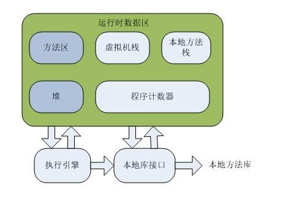

# 运行时数据区

Java虚拟机在执行程序的过程中会把它管理的内存区域分为若干个不同的数据区域。这些区域有着各自的用途，不同的创建和销毁的时间，有的区域随着虚拟机进程的启动而存在，有些区域则依赖用户线程的启动和结束而建立和销毁。根据“Java SE 7”的JVM虚拟机规范，JVM管理的内存大致包括如下几个运行时数据区域，如下图所示：

图解：**其中置灰部分是随虚拟机启动而存在的，线程共享；白色区域则是跟随线程启动而存在的，线程私有**

**jdk 8中方法区被移除，取而代之的是metaspace（元数据空间）**

## 程序计数器

占据一小块的内存空间，可以看做当前线程所执行的字节码的行号指示器。在虚拟机概念模型里，字节码解析器工作时就是通过改变这个计数器的值来选取下一条需要执行的字节码指令，分支、循环、跳转、异常处理、线程恢复等基础功能都需要依赖这个计数器来完成。

由于JVM的多线程是通过线程轮流切换并分配到处理器执行时间的方式来实现的，在任何一个确定的时刻，一个处理器都只会执行一条线程中的指令。因此，为了线程切换后能恢复到正确的执行位置，每条线程都需要有一个独立的程序计数器，各线程之间计数器互不影响，独立存储，我们称这类内存区域为“线程私有”的内存。

### 程序计数器的特点

- 线程隔离性，每个线程工作时都有属于自己的独立计数器
- 生命周期和线程相同，即随着线程的创建而创建，随着线程的结束而结束
- 执行的java方法，这个计数器记录的则是正在执行的虚拟机字节码指令的地址
- 执行native本地方法时，程序计数器的值为空
- 程序计数器占用内存很小、在进行JVM内存计算时，可以忽略不计
- 此内存区域是唯一一个在Java虚拟机规范中没有规定任何**OutOfMemoryError**情况的区域

