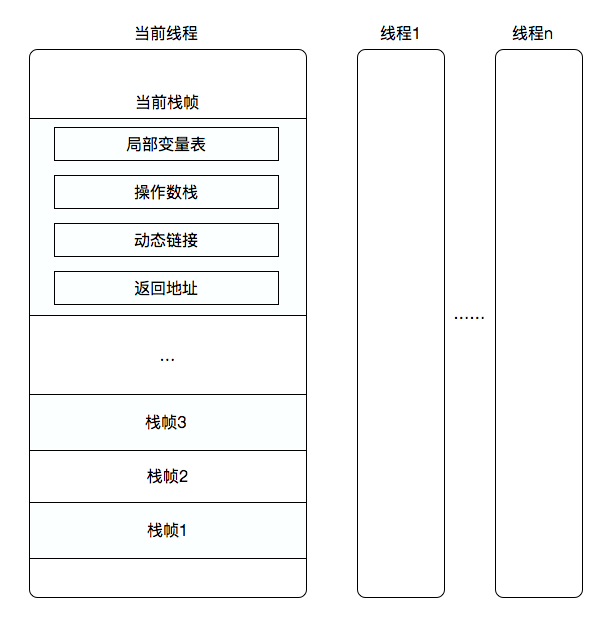

# 运行时数据区

Java虚拟机在执行程序的过程中会把它管理的内存区域分为若干个不同的数据区域。这些区域有着各自的用途，不同的创建和销毁的时间，有的区域随着虚拟机进程的启动而存在，有些区域则依赖用户线程的启动和结束而建立和销毁。根据“Java SE 7”的JVM虚拟机规范，JVM管理的内存大致包括如下几个运行时数据区域，如下图所示：

图解：**其中置灰部分是随虚拟机启动而存在的，线程共享；白色区域则是跟随线程启动而存在的，线程私有**

## 程序计数器

占据一小块的内存空间，可以看做当前线程所执行的字节码的行号指示器。在虚拟机概念模型里，字节码解析器工作时就是通过改变这个计数器的值来选取下一条需要执行的字节码指令，分支、循环、跳转、异常处理、线程恢复等基础功能都需要依赖这个计数器来完成。

由于JVM的多线程是通过线程轮流切换并分配到处理器执行时间的方式来实现的，在任何一个确定的时刻，一个处理器都只会执行一条线程中的指令。因此，为了线程切换后能恢复到正确的执行位置，每条线程都需要有一个独立的程序计数器，各线程之间计数器互不影响，独立存储，我们称这类内存区域为“线程私有”的内存。

### 程序计数器的特点

- 线程隔离性，每个线程工作时都有属于自己的独立计数器
- 生命周期和线程相同，即随着线程的创建而创建，随着线程的结束而结束
- 执行的java方法，这个计数器记录的则是正在执行的虚拟机字节码指令的地址
- 执行native本地方法时，程序计数器的值为空
- 程序计数器占用内存很小、在进行JVM内存计算时，可以忽略不计
- 此内存区域是唯一一个在Java虚拟机规范中没有规定任何**OutOfMemoryError**情况的区域

## 虚拟机栈

与程序计数器一样，Java的虚拟机栈也是线程私有的，虚拟机栈描述的是Java的方法执行的内存模型，每个方法在执行的同时都会创建一个栈帧，通常所说的JVM里面的“堆和栈”这个栈就是虚拟机栈

### 栈帧结构介绍

栈帧是虚拟机运行时数据区中的虚拟机栈的栈元素。栈帧中存储了方法的局部变量表、操作数栈、动态链接和方法返回地址等信息。每一个方法从调用开始到执行结束的过程，都对应着一个栈帧在虚拟机里面从入栈到出栈的过程。

一个线程中的方法调用链可能会很长，很多方法都同时处于执行状态。对于执行引擎来说，在活动线程中，只有位于栈顶的栈帧才是有效的，称为`当前栈帧(Current Stack Frame)`，与这个栈帧关联的方法称为`当前方法(Current Method)`。栈帧结构如下：

- 局部变量表

  用于存放方法参数和方法内部定义的局部变量。在编译期由Code属性中的max_locals确定局部变量表的大小（局部变量表所需的内存在编译期就已经确定了也就是进入这个方法时就已经确定了，运行期间不会更改）。局部变量表的容量已`变量槽（Variable Slot）`为最小单位。

  > 虚拟机规范中并没有明确指明一个Slot应占用的内存空间，只是很有导向性地说到了每个Slot都应该能存放一个boolean、byte、char、short、int、float、reference或return Address类型地数据。这8种数据类型都可以使用32位或更小的物理内存来存放，但这种描述与明确指出“每个Slot占用32位长度的内存空间”是有一些差别的，它允许Slot的长度可以随着处理器、操作系统或虚拟机的不同而发生变化。只要保证即使在64位虚拟机中使用了64位的物理内存空间去实现一个Slot，虚拟机仍要使用对齐和补白的手段让Slot在外观上看起来与32位虚拟机中的一致。

  `注意：`

  - 对于64位的数据类型（明确的由long和double，reference可能32位或64位），虚拟机会以高位对齐地方式为其分配两个的Slot空间
  - 虚拟机通过索引定位的方式使用局部变量表,索引值的范围是从0开始至局部变量表最大的Slot数量。如果访问的是32位数据类型的变量,索引n就代表了使用第n个Slot,如果是64位数据类型的变量,则说明会同时使用n和n+1两个Slot。
  - 局部变量表中第0位索引的Slot默认`this`关键字的引用。
  - **Slot可重用**，方法体中定义的变量，其作用域并不一定会覆盖整个方法体，如果当前字节码PC计数器的值已经超出了某个变量的作用域，那这个变量对应的Slot就可以交给其他变量使用。

- 操作数栈

  同局部变量表一样，操作数的最大深度也在编译的时候写入到Code属性的max_stacks数据项中。操作数栈的每一个元素可以是任意的Java数据类型，包括long和double。32位数据类型所占的栈容量为1，64位数据类型所占的栈容量为2。

  - 操作数栈可以理解为Java虚拟机中的一个用于计算的临时数据存储区；与局部变量表一样，均以字长为单位的数组。不过局部变量表用的是索引，操作数栈是出栈/入栈来访问
  - 存储的数据与局部变量表一致含int、float、double、reference、returnType，操作数栈中的byte、shot、char压栈（bipush）前会被转为int
  - 数据运算的地方，大多数指令都在操作数栈出栈运算、然后结果入栈

- 动态链接

  - 每个栈帧都包含一个指向运行时常量池中该栈帧所属方法的引用，持有这个引用是为了支持方法调用过程中的动态连接（Dynamic Linking）

  - 在类加载阶段中的解析阶段会将符号引用转为直接引用，这种转化也称为静态解析。另外的一部分将在每一次运行时期转化为直接引用。这部分称为动态连接

- 返回地址

  当一个方法开始执行后，只有两种方式可以退出，一种是遇到方法返回的字节码指令；一种是遇到异常，并且这个异常没有在方法体内得到处理

## 本地方法栈

本地方法栈和虚拟机栈相似，区别就是虚拟机栈为虚拟机执行Java方法服务，而本地方法栈则为虚拟机执行Native方法服务；有些虚拟机（比如 HotSpot虚拟机）直接将就把本地方法栈和虚拟机栈合二为一。

## 方法区

方法区主要用来存储已经被虚拟机加载的类信息（Class）、常量（final）、静态变量（static）、JIT（即时编译器）编译后的代码等数据

### 永久代

永久代是 HotSpot 虚拟机在 JDK7 及以前对方法区的具体实现，而永久代也在 heap 中(但注意，其它虚拟机并没有永久代，这是 HotSpot 虚拟机特有的)

在 JDK1.7 中，移除永久代的工作就已经开始了，原先存储在永久代的部分数据转移到了Java heap 或者 native memory，但永久代仍存在于 JDK1.7 中，并没完全移除。移除工作主要包括下面三点：

- 符号引用(Symbolic Reference)转移到了native memory
- Interned Strings转移到了heap
- 静态变量从instanceKlass对象(PermGen内)末尾转移到了java.lang.Class对象(heap内)的末尾

### 元空间（Metaspace）

从 JDK 8 开始的 HotSpot 虚拟机完全移除了永久代，改为在 native memory 里存放这些元数据。新的用于存放元数据的内存空间叫做 Metaspace（元数据空间）

## 堆

堆是JVM里最大的一块内存区域，被所有线程共享，在虚拟机启动时创建，此区域的目的就是存放对象实例合数组，几乎所有的对象实例都在这里分配。大部分收集器都采用分代收集算法，所以JVM中的堆又分为新生代、老年代。新生代又分为Eden空间、From Survivor 和 To Survivor空间。无论怎么划分都是为了更好的回收、分配、利用内存。