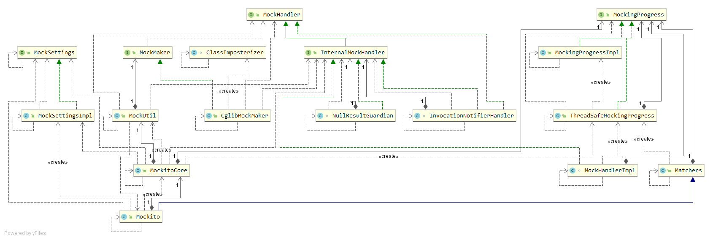

# Mockito v1 执行过程分析

## 1、基本使用

- mock

  ```java
  // mock 一个List对象。Mockito会记住它所mock对象的所有调用，为后面的验证做准备
  List list = Mockito.mock(List.class)
  ```

- when

  ``` java
  // 下面代码的意思是当调用list.size()方法时返回1
  // 这样我们就可以mock对象的行为了
  Mockito.when(list.size()).thenReturn(1);
  ```

- verify

  ```java
  // 下面代码的目的是验证是否调用了mock对象的某个方法
  Mockito.verify(list).size();
  ```

## 2、类图



## 3、mockito创建mock对象的过程

​	由上面的基本使用可知，mockito创建mock对象的方式：

``` java
List list = Mockito.mock(List.class)
```

​	下面具体分析上面一行代码具体做了什么

### Mockito#mock

``` java
/**
  * 创建一个mock实例
  * @param classToMock  需要mock的接口或者类
  */
public static <T> T mock(Class<T> classToMock) {
    // [1] withSettings 
    return mock(classToMock, withSettings().defaultAnswer(RETURNS_DEFAULTS));
}

public static <T> T mock(Class<T> classToMock, MockSettings mockSettings) {
    // static final MockitoCore MOCKITO_CORE = new MockitoCore();
    // 调用 MockitoCore的mock方法
    return MOCKITO_CORE.mock(classToMock, mockSettings);
}
```

[1] withSettings返回的是mock对象的配置信息，配置项包含的内容很多，后面会详细介绍

### MockitoCore#mock

```java
public <T> T mock(Class<T> typeToMock, MockSettings settings) {
    if (!MockSettingsImpl.class.isInstance(settings)) {
        throw new IllegalArgumentException("...");
    }
    // 强制类型转换
    MockSettingsImpl impl = MockSettingsImpl.class.cast(settings);
    // [2]校验mock配置信息是否正确
    MockCreationSettings<T> creationSettings = impl.confirm(typeToMock);
    // [3]创建真正的mock对象
    T mock = mockUtil.createMock(creationSettings);
    // [4]
    mockingProgress.mockingStarted(mock, typeToMock);
    return mock;
}
```

[3] mockUtil.createMock创建真正的mock对象

### MockUtil#createMock

``` java
public <T> T createMock(MockCreationSettings<T> settings) {
    // [5]
    MockHandler mockHandler = new MockHandlerFactory().create(settings);
	// [6]
    T mock = mockMaker.createMock(settings, mockHandler);
	// [7] spy
    Object spiedInstance = settings.getSpiedInstance();
    if (spiedInstance != null) {
        new LenientCopyTool().copyToMock(spiedInstance, mock);
    }

    return mock;
}
```

// [5] 通过MockHandlerFactory创建mock的处理器对象，用于计算mock对象操作的结果

#### MockHandlerFactory#create

``` java
public InternalMockHandler create(MockCreationSettings settings) {
    // 核心处理器
    InternalMockHandler handler = new MockHandlerImpl(settings);
    // 处理null和基本数据类型(静态代理)
    InternalMockHandler nullResultGuardian = new NullResultGuardian(handler);
    // 通知监听者：调用方法后，通知listener
    InternalMockHandler notifier = new InvocationNotifierHandler(nullResultGuardian, settings);
    return notifier;
}
```

// [6]这里的mockMaker是全局变量，下面详细介绍它是如何获取到的

#### MockMaker对象的获取

``` java
// 通过插件获取该对象
MockMaker mockMaker = Plugins.getMockMaker();
```

``` java
// Plugins.java
private static PluginRegistry registry = new PluginRegistry();

public static MockMaker getMockMaker() {
    return registry.getMockMaker();
}
```

``` java
// [8] PluginRegistry.java
private final MockMaker mockMaker
    = new PluginLoader(pluginSwitch).loadPlugin(MockMaker.class, "org.mockito.internal.creation.cglib.CglibMockMaker");

private final StackTraceCleanerProvider stackTraceCleanerProvider
    = new PluginLoader(pluginSwitch).loadPlugin(StackTraceCleanerProvider.class, "org.mockito.internal.exceptions.stacktrace.DefaultStackTraceCleanerProvider");
```

[8] PluginRegistry是一个独立的模块，后面会详细介绍。大概上可以猜测到MockMaker使用的是CglibMockMaker实现

#### CglibMockMaker#createMock

``` java
public <T> T createMock(MockCreationSettings<T> settings, MockHandler handler) {
    // 强制类型转换
    InternalMockHandler mockitoHandler = cast(handler);
    // settings配置接口中添加 AcrossJVMMockitoMockSerializable 接口，这个接口中包含writeReplace方法
    // writeReplace方法可以控制要序列化的对象
    new AcrossJVMSerializationFeature().enableSerializationAcrossJVM(settings);
    // [9]
    return new ClassImposterizer(new InstantiatorProvider().getInstantiator(settings)).imposterise(
        // 会改变原有方法的行为
        new MethodInterceptorFilter(mockitoHandler, settings), settings.getTypeToMock(), settings.getExtraInterfaces());
}
```

[9] new InstantiatorProvider().getInstantiator(settings) 是用来获取创建实例的工具类对象

#### InstantiatorProvider

``` java
private final static Instantiator INSTANCE = new ObjenesisInstantiator();

public Instantiator getInstantiator(MockCreationSettings settings) {
    if (settings.isUsingConstructor()) {
        // 如果配置中指定了需要使用构造器创建实例，就返回ConstructorInstantiator对象
        return new ConstructorInstantiator(settings.getOuterClassInstance());
    } else {
        // Objenesis 可以绕开对象实例构造器实例化对象
        // 原理：通过Java序列化实例化对象
        return INSTANCE;
    }
}
```

#### ClassImposterizer#imposterise 创建代理实例

``` java
public <T> T imposterise(final MethodInterceptor interceptor, Class<T> mockedType, Collection<Class> ancillaryTypes) {
    return imposterise(interceptor, mockedType, ancillaryTypes.toArray(new Class[0]));
}
/**
  * 创建代理类和实例
  */
public <T> T imposterise(final MethodInterceptor interceptor, Class<T> mockedType, Class<?>... ancillaryTypes) {
    Class<Factory> proxyClass = null;
    Object proxyInstance = null;
    try {
        // 设置构造函数访问权限
        setConstructorsAccessible(mockedType, true);
        // [10]创建代理类
        proxyClass = createProxyClass(mockedType, ancillaryTypes);
        // [11]实例化代理类
        proxyInstance = createProxy(proxyClass, interceptor);
        // 强制类型转换成 mockedType
        return mockedType.cast(proxyInstance);
    } catch (ClassCastException cce) {
        throw new MockitoException("...");
    } finally {
        setConstructorsAccessible(mockedType, false);
    }
}
```

#### 创建代理类

``` java
public Class<Factory> createProxyClass(Class<?> mockedType, Class<?>... interfaces) {
    if (mockedType == Object.class) {
    	// 一个特殊的类，相当于Object，但是类型更加明确
        mockedType = ClassWithSuperclassToWorkAroundCglibBug.class;
    }
    
    // 创建 Enhancer 对象子类，不过滤私有构造函数
    Enhancer enhancer = new Enhancer() {
        @Override
        @SuppressWarnings("unchecked")
        protected void filterConstructors(Class sc, List constructors) {
            // Don't filter
        }
    };
    // mockedType + interfaces 所有的类型
    Class<?>[] allMockedTypes = prepend(mockedType, interfaces);
    // 类的classLoader可能会有多个，按照层级组合起来，构成 SearchingClassLoader
	enhancer.setClassLoader(SearchingClassLoader.combineLoadersOf(allMockedTypes));
	// 需要实现 Factory 接口
    enhancer.setUseFactory(true);
    // 判断mockedType是 接口 还是 类
    if (mockedType.isInterface()) {
        enhancer.setSuperclass(Object.class);
        enhancer.setInterfaces(allMockedTypes);
    } else {
        enhancer.setSuperclass(mockedType);
        enhancer.setInterfaces(interfaces);
    }
    // 设置方法拦截器
    enhancer.setCallbackTypes(new Class[]{MethodInterceptor.class, NoOp.class});
    // 设置方法过滤(不拦截桥接方法)
    enhancer.setCallbackFilter(IGNORE_BRIDGE_METHODS);
    // 设置命名策略，默认 FastSource$$FastClassByCGLIB$$e1a36bab.class
    if (mockedType.getSigners() != null) { // 判断类的签名
  	enhancer.setNamingPolicy(NAMING_POLICY_THAT_ALLOWS_IMPOSTERISATION_OF_CLASSES_IN_SIGNED_PACKAGES);
    } else {
        enhancer.setNamingPolicy(MockitoNamingPolicy.INSTANCE);
    }

    enhancer.setSerialVersionUID(42L);
    
    try {
    	// [12]创建类对象
        return enhancer.createClass();
    } catch (CodeGenerationException e) {
        
        throw new MockitoException("...", e);
    }
}
```


#### 实例化代理类

``` java
private Object createProxy(Class<Factory> proxyClass, final MethodInterceptor interceptor) {
    Factory proxy;
    try {
    	// 使用Objenesis实例化器创建代理对象
        proxy = instantiator.newInstance(proxyClass);
    } catch (InstantationException e) {
        throw new MockitoException("...", e);
    }
    proxy.setCallbacks(new Callback[] {interceptor, SerializableNoOp.SERIALIZABLE_INSTANCE });
    return proxy;
}
```

### PluginRegistry 插件模块

#### PluginSwitch 接口，它只有一个方法isEnabled，表示当前插件是否可用

``` java
public interface PluginSwitch {
    boolean isEnabled(String pluginClassName);
}
```

加载 PluginSwitch 的代码如下

``` java
// PluginRegistry.java
PluginSwitch pluginSwitch
            = new PluginLoader(new DefaultPluginSwitch()).loadPlugin(PluginSwitch.class, DefaultPluginSwitch.class.getName());
```

从上面的代码可以看出，加载PluginSwitch使用到了PluginLoader，下面具体分析 PluginLoader

#### PluginLoader加载插件

``` java
<T> T loadPlugin(Class<T> pluginType, String defaultPluginClassName) {
    T plugin = loadImpl(pluginType);
    if (plugin != null) {
        return plugin;
    }

    try {
        return pluginType.cast(Class.forName(defaultPluginClassName).newInstance());
    } catch (Exception e) {
        throw new MockitoException("...");
    }
}

<T> T loadImpl(Class<T> service) {
    ClassLoader loader = Thread.currentThread().getContextClassLoader();
    if (loader == null) {
        loader = ClassLoader.getSystemClassLoader();
    }
    Enumeration<URL> resources;
    try {
        // 加载classpath路径下“mockito-extensions/插件名”的文件
        resources = loader.getResources("mockito-extensions/" + service.getName());
    } catch (IOException e) {
        throw new MockitoException("Failed to load " + service, e);
    }

    try {
        // PluginFinder 判断某个插件是否可以被加载
        String foundPluginClass = new PluginFinder(pluginSwitch).findPluginClass(Iterables.toIterable(resources));
        if (foundPluginClass != null) {
            Class<?> pluginClass = loader.loadClass(foundPluginClass);
            Object plugin = pluginClass.newInstance();
            return service.cast(plugin);
        }
        return null;
    } catch (Exception e) {
        throw new MockitoConfigurationException(
            "Failed to load " + service + " implementation declared in " + resources, e);
    }
}
```

因为classpath路径下mockito-extensions目录，所以都使用默认的插件类

- PluginSwitch —— DefaultPluginSwitch（所以插件都可用）
- MockMaker —— CglibMockMaker（使用cglib创建mock对象，但是要求该对象不能是基本数据类型和final修饰的类）

## 4、方法调用执行拦截过程分析

根据上面的执行过程分析可以看出，主要的拦截器如下：

- MethodInterceptorFilter 依赖 InternalMockHandler
  - MockHandlerImpl mock(when/answer)主要的处理类
  - NullResultGuardian 当没有定义when时默认的一些返回结果
  - InvocationNotifierHandler 起到包装和方法调用通知作用，用户包装前面的InternalMockHandler实例
- SerializableNoOp 无具体操作

