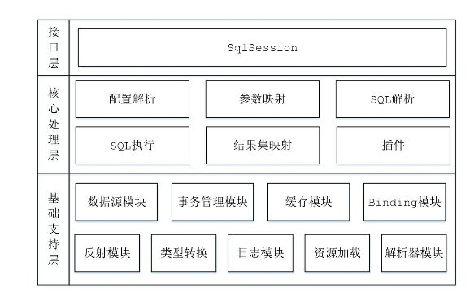
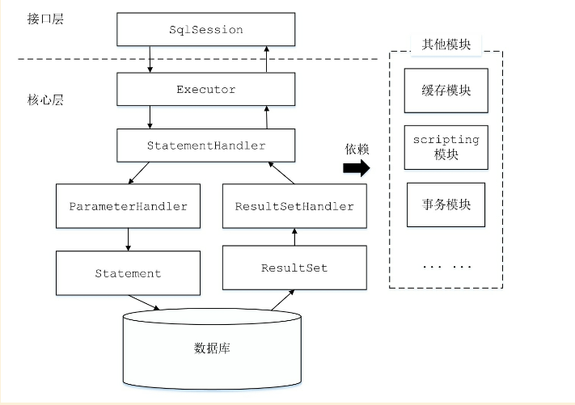

# MyBatis

## 来历和简介

前生是ibatis

Mybatis是一款轻量的持久层框架，它支持定制SQL、存储过程以及高级映射。Mybatis几乎避免了所以的JDBC代码和手动设置参数以及获取结果集。

Mybatis可以使用注解或者xml通过接口映射Java的POJO和数据库中的记录

## 使用示例

1. 引用mybatis.jar文件

2. 配置mybatis-config.xml配置文件

   ```xml
   <?xml version="1.0" encoding="UTF-8" ?>
   <!DOCTYPE configuration PUBLIC "-//mybatis.org//DTD Config 3.0//EN"
     "http://mybatis.org/dtd/mybatis-3-config.dtd">
   <configuration>
     <properties>
       <!-- 定义属性和值 -->
       <property name="username" value="root" />
       <!-- ... -->
     </properties>
     <settings>
       <!-- 全局配置信息 -->
       <setting name="cacheEnabled" value="true" />
       <!-- ... -->
     </settings>
     <environments default="development"> <!-- 设置默认环境 -->
       <environment id="development">
         <!-- 配置事务管理器类型 -->
         <transactionManager type="JDBC"/>
         <!-- 配置数据源类型、数据库连接的相关信息 -->
         <dataSource type="POOLED">
           <property name="driver" value="${driver}"/>
           <property name="url" value="${url}"/>
           <property name="username" value="${username}"/>
           <property name="password" value="${password}"/>
         </dataSource>
       </environment>
     </environments>
     <!-- 配置映射文件的位置 -->
     <mappers>
       <mapper resource="org/mybatis/example/BlogMapper.xml"/>
     </mappers>
   </configuration>
   ```

3. 配置`BlogMapper.xml`

   ```xml
   <?xml version="1.0" encoding="UTF-8" ?>
   <!DOCTYPE mapper PUBLIC "-//mybatis.org//DTD Mapper 3.0//EN"
     "http://mybatis.org/dtd/mybatis-3-mapper.dtd">
   <mapper namespace="org.mybatis.example.BlogMapper">
     <select id="selectBlog" resultType="Blog">
       select * from Blog where id = #{id}
     </select>
   </mapper>
   ```

   

4. 使用xml构建SqlSessionFactory

   ```java
   String resource = "org/mybatis/example/mybatis-config.xml";
   InputStream inputStream = Resources.getResourceAsStream(resource);
   SqlSessionFactory sqlSessionFactory = new SqlSessionFactoryBuilder().build(inputStream);
   ```

5. 从SqlSessionFactory中获取SqlSession

   ```java
   try (SqlSession session = sqlSessionFactory.openSession()) {
       // ... ...
   }
   ```

   

6. 从SqlSession中获取Mapper映射器对象实例，调用Mapper映射器接口中的方法执行查询操作

   ```java
   try (SqlSession session = sqlSessionFactory.openSession()) {
       BlogMapper mapper = session.getMapper(BlogMapper.class);
       Blog blog = mapper.selectBlog(101);
   }
   ```

   

## Mybatis整体架构



### 基础支持层

主要模块介绍

- 类型转换模块
  - 别名机制
  - Java类型和JDBC类型相互转换
    - SQL语句绑定实参时，会将数据由java类型转换成JDBC类型
    - 映射结果集时，会将数据由JDBC类型转换成Java类型
- 缓存模块
  - 一级缓存
  - 二级缓存
- Binding模块
  - 将用户自定义的Mapper接口与映射配置文件关联起来

### 核心处理层

复杂模块介绍

- 配置解析

  - mybatis-config配置文件
  - 映射配置文件和Mapper中的注解信息
    - resultMap节点
    - select/insert/delete/remove节点

- SQL解析与scripting模块

- SQL执行

  - Executor

    - 负责一级缓存和二级缓存
    - 事务管理
    - 数据库相关的操作交给StatementHandler处理

  - StatementHandler

    - 通过ParameterHandler完成SQL语句的实参绑定
    - 通过Statement执行SQL并获取结果集
    - 通过ResultSetHandler完成结果集的映射

  - ParameterHandler

    - 获取用户传入的参数
    - 完成参数绑定—设置PreparedStatement中的SQL参数

  - ResultSetHandler

    - 将Statement查询出来的信息转化成POJO对象

    

- 插件

  - 代理Executor/StatementHandler/ParameterHandler/ResultSetHandler接口中的方法

### 接口层

提供SqlSession接口，用户可以通过调用其中的方法完成具体的数据库操作


## 基础支持层

DOM解析

反射

类型转换 Java ==== jdbc

- TypeHandler
- TypeHandlerRegistry
- TypeAliasRegistry

日志

	- 适配器模式——支持多种日志

资源加载

- 类加载器 ClassLoaderWrapper
- ResolverUtil 根据指定条件查找指定包下的类
- VFS 虚拟文件系统

数据源模块DataSource

- DataSourceFactory

- UnpooledDataSource
- PooledDataSource
- Transaction 事务

binding模块

- Mapper接口和xml配置对应
- session.getMapper
- MapperProxy
- MapperMethod

缓存模块

- Cache接口
  - PerpetualCache
  - BlockingCache
  - FifoCache
  - LruCache  
- CacheKey

## 核心处理层

- XMLConfigBuilder 解析mybatis-config.xml整体的配置文件
- XMLMapperBuilder 解析映射xml文件
- XMLStatementBuilder 解析映射文件中的<insert <delete <update <select <resultMap这些节点信息
- SqlNode 解析xml中配置的SQL得到的Sql片段信息
- SqlSource 可以得到`BoundSql`对象，里面封装了可执行的SQL语句和查询参数信息
- ResultSetHandler 从数据查询出来表信息=>到=>普通的POJO实例对象
- KeyGenerator 生成主键相关的处理
- Jdbc3KeyGenerator 和 SelectkeyGenerator 生成主键的两种方式
- StatementHandler 核心接口之一，可以获取Statement对象，绑定statement执行所需的参数
- ParameterHandler setParameters()，该方法负责具体的实参绑定
- Executor Mybatis的核心接口，定义了数据库操作的基本方法。在实际应用中经常涉及的SqlSession接口的功能，都是基于Executor接口实现的
  - BaseExecutor 是实现了 Executor 接口的抽象类，使用了模板方法模式
- 