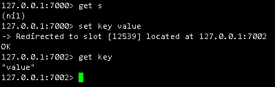
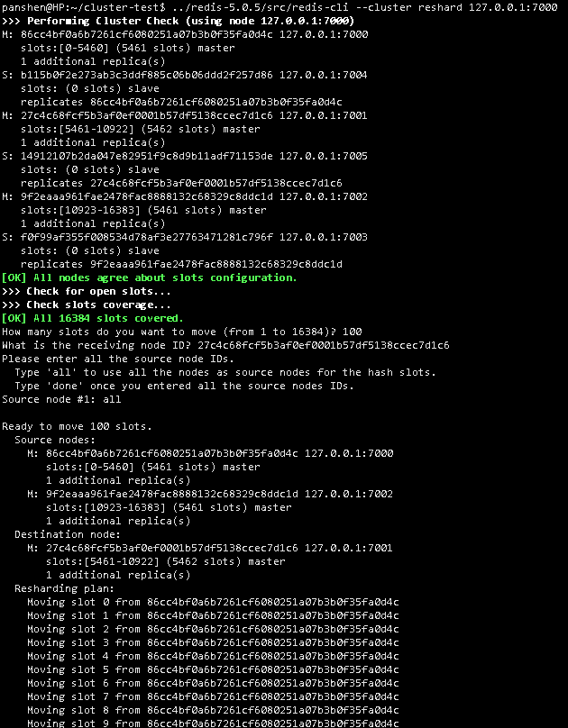
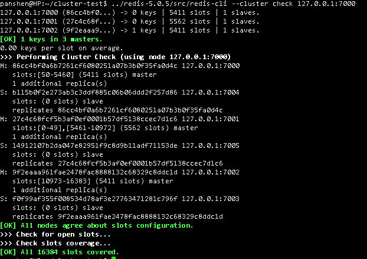

# Cluster

## 部署

### 最小选项的配置

更多的配置参数说明可以参考官方的默认配置文件redis.conf，里面包含更为丰富cluster集群参数和说明

> ```
> # cluster 节点端口
> port 7000
> # 后台运行模式
> daemonize yes
> # pid 文件路径
> pidfile redis_7000.pid
> # 启用cluster 模式
> cluster-enabled yes
> # 保存节点配置文件的路径
> cluster-config-file nodes.conf
> cluster-node-timeout 5000
> appendonly yes
> ```


### 节点数

要让集群正常运作至少需要三个主节点。 强烈建议使用六个节点： 其中三个为主节点， 而其余三个则是各个主节点的从节点。

### 启动服务

```shell
./redis-server ./redis.conf
```

### 搭建集群

官方文档中的redis-trib.rb命令（可能提示已经过时，提示你应该使用redis-cli命令）

```shell
./redis-trib.rb create --replicas 1 127.0.0.1:7000 127.0.0.1:7001 127.0.0.1:7002 127.0.0.1:7003 127.0.0.1:7004 127.0.0.1:7005
```

```shell
redis-cli --cluster create 127.0.0.1:7000 127.0.0.1:7001 127.0.0.1:7002 127.0.0.1:7003 127.0.0.1:7004 127.0.0.1:7005 --cluster-replicas 1
```

按照提示输入yes，redis-trib 就会将这份配置应用到集群当中

## 集群使用

### 测试集群

使用redis-cli 连接集群中的任意一个节点

```shell
redis-cli -c -p 7000
```



### 集群重新分片

将某些节点的哈希槽移动到另外一些节点上面，重新分配不影响在线使用

```shell
./redis-trib.rb reshard 127.0.0.1:7000
```

```shell
./redis-cli --cluster reshard 127.0.0.1:7000
```



### 检查集群状态

```shell
./redis-trib.rb check 127.0.0.1:7000
```

```shell
./redis-cli --cluster check 127.0.0.1:7000
```



### 测试故障转移

触发一次故障转移， 最简单的办法就是令集群中的某个主节点进入下线状态

#### 使用debug segfault 命令，让某个主节点崩溃


### 添加新节点

- 添加新节点
  - 添加主节点
  - 添加从节点
- 移动一些数据给它

- 添加主节点

```shell
./redis-trib.rb add-node 127.0.0.1:7006 127.0.0.1:7000
```

```shell
./redis-cli --cluster add-node 127.0.0.1:7006 127.0.0.1:7000
```

- 添加从节点

```shell
./redis-trib.rb add-node --slave [--master-id 3c3a0c74aae0b56170ccb03a76b60cfe7dc1912e 指定主节点id/不指定自动分配] 127.0.0.1:7007 127.0.0.1:7000
```

```shell
# **查看参数说明命令**
./redis-cli --cluster help

./redis-cli redis-cli --cluster  add-node 127.0.0.1:7007 127.0.0.1:7000 --cluster-slave [--cluster-master-id 19fab7d313dee8dea5377dbf7ed953c918c461fb 指定主节点id/不指定自动分配]
```

### 删除节点


```shell
./redis-trib del-node 127.0.0.1:7000 86cc4bf0a6b7261cf6080251a07b3b0f35fa0d4c
```


```shell
./redis-cli --cluster del-node 127.0.0.1:7000 86cc4bf0a6b7261cf6080251a07b3b0f35fa0d4c
```


### 查看集群slot信息

``` shell
./redis-cli --cluster info 127.0.0.1:7000
```

