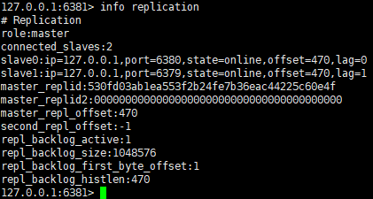

# Redis 集群

## 主从模式

- redis-cli命令 slaveof host post 把当前redis实例设置为某个节点的从结点
  - slaveof no one 命令可以把当前从结点又变成master结点
- 启动redis服务时添加 --slaveof ip port
- 修改配置文件 设置 `slaveof <masterip> <masterport>`参数


### 查看集群信息

`info replication`



### 主从复制原理

#### 第一次连接到主节点 执行全量复制

1. 每个结点都有一个定时任务 ，每隔1s检测一次是否成为了其他结点的从结点；如果是，则执行下一步

2. 和master建立socket连接，以便接着进行主从同步

3. redis主从同步包括连个阶段：初始化阶段和进行阶段

4. 初始化阶段master 通过bgsave 生成rdb文件，发送到slave结点。

   - 如果发送时间比较长超过了 repl-timeout时间，master会终端连接重新发送rdb文件，可能会陷入死循环，如果数据量很多，生成的rdb文件很大，从结点读取和解析的时间比较长的话，可以增加repl-timeout的时间
   - repl-timeout时间 > master 生成rdb的时间 + rdb文件发送到slave的时间 + slave通过rdb恢复数据的时间

5. 在初始化阶段，master在复制缓冲区保存数据的变化。初始化完成后，复制缓冲区的内容会同步到slave服务器

   - 复制缓冲区达到容量限制，也会导致复制失败，复制会重新开始。为了避免这种情况可以适当增大复制缓存区的大小

   - 复制缓存区大小配置

     ```
     # 设置普通的客户端
     client-output-buffer-limit normal 0 0 0
     # slave客户端
     client-output-buffer-limit slave 256mb 64mb 60
     # 发布/订阅模式
     client-output-buffer-limit pubsub 8mb 2mb 60
     ```

6. 初始化阶段完成后，进入进行阶段。这个阶段直接通过命令传播保持同步，也就是通过建立的连接直接同步命令。所以一般不会出有什么问题

7. 当slave和master由于某些原因中途断开了连接，存在了数据差异；后续重新建立了连接后会进行增量同步，通过`info replication` 中的偏移量`master_repl_offset`进行同步

## Sentinel 哨兵模式

当master挂掉后，sentinel有能力将slave结点提升为master

### 启动方式

- ./redis-server sentinel.conf --sentinel
- ./redis-sentinel sentinel.conf

### master异常后处理流程

- 再sentinel中选举Leader结点（Raft算法）

- Leader结点设置新的master结点


### Raft算法

- 先到先得

## Jedis Shading

jedis客户端实现的分片算法，将不同的key通过一定的hash算法，分布到不同的redis实例上

## Cluster

hash tag的应用 计算槽时只取{}里面的字符来计算

{xx} 将不同的key路由到相同的槽中 a{user}b {user}c