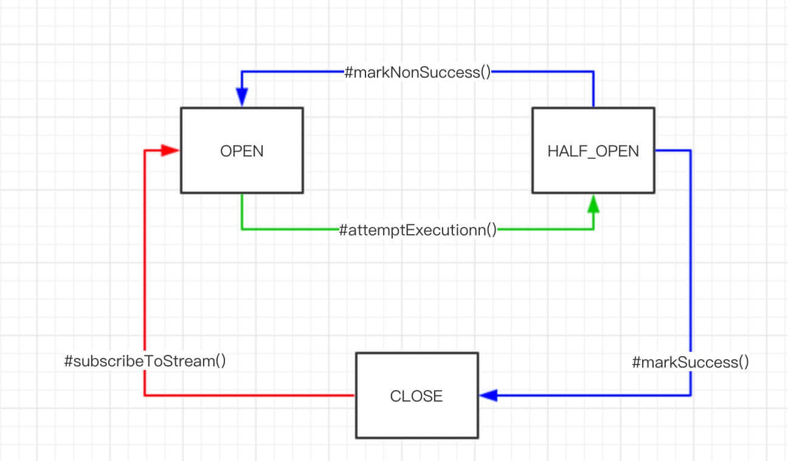

# hystrix

## 介绍

- Netflix开源的分布式系统的延迟和容错库
- 提供延迟和容错功能，隔离远程系统和第三方程序库的访问，防止级联失败
- 主要特性
  - fallback服务降级
  - 断路器机制
  - 资源隔离

## 服务降级

调用失败时，可以通过hystrix实现Fallback服务降级

@HystrixCommand(fallbackMethod) 当请求服务发生异常时，执行fallback方法得到返回结果

## 断路器机制

hystrix内置断路器HystrixCricuitBreaker实现，一种有三种状态

- CLOSED：关闭
- OPEN：打开
- HALF_OPEN 半开

> HystrixCircuitBreaker 设计的比较好的地方是增加了 `HALF_OPEN` 状态，不仅实现了自动化关闭，还实现了自动化的打开

状态变化示意图：

1. **红线**：初始时，断路器出于`CLOSED`状态，链路处于`健康`状态。当满足如下条件时，断路器`OPEN`状态
2. **绿线**：断路器处于`OPEN`状态，命令执行时，若当前时间超过断路器**开启**时间一定时间( `HystrixCommandProperties.circuitBreakerSleepWindowInMilliseconds = 5000 ms` )，断路器变成`HALF_OPEN`状态，尝试调用正常的逻辑，根据执行是否成功，打开或关闭断路器

## 资源隔离

hystrix通过线程池和信号量（Semaphore）两种模式来实现隔离

### 线程池模式

默认情况下，hystrix采用线程池模式来实现隔离

针对调用的每一个服务，我们给其**单独**分配一个线程池。例如说，产品服务的调用分配在 A 线程池，用户服务的调用分配在 B 线程池。这样隔离后，两个服务的调用不会相互影响

### 信号量模式

使用线程池模式来隔离时，需要进行上下文的切换，带来一定的性能损耗。因此，如果对性能有较高要求，且能够接受信号量模式不支持**超时**的情况，可以考虑采用信号量模式

