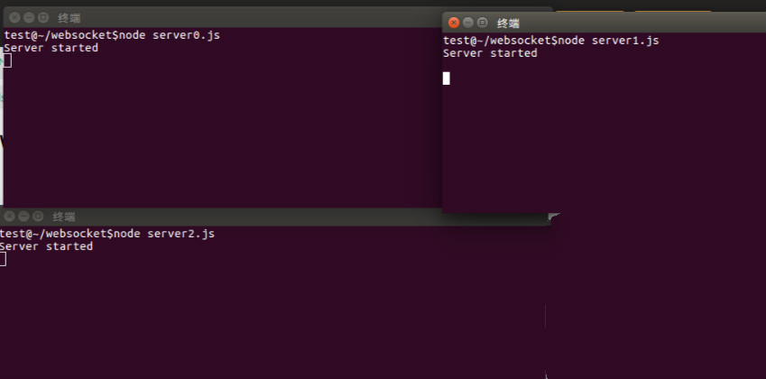
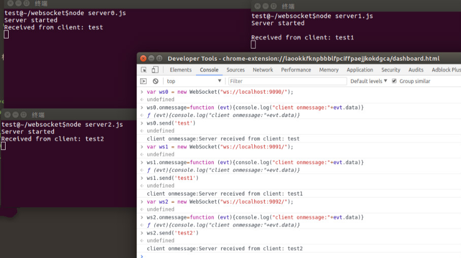
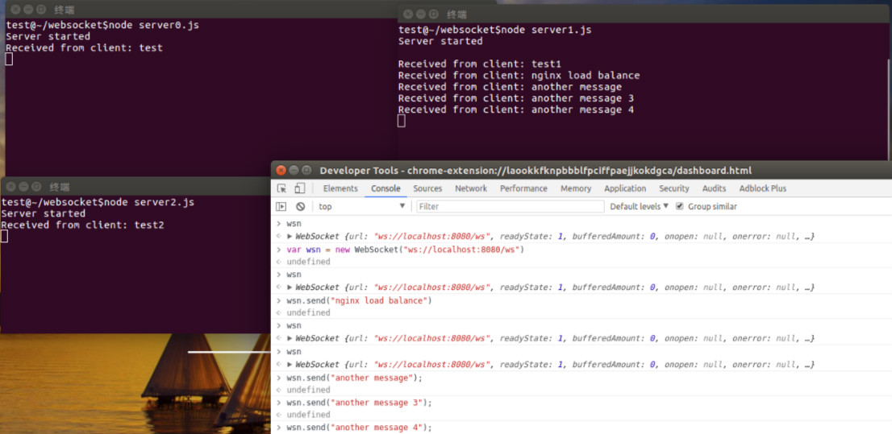
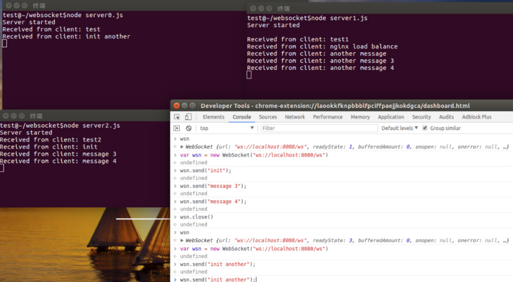

# 使用nginx实现websocket的负载均衡

当web应用访问量过大时，我们就需要做负载均衡，将同一个域名的请求分散到不同的服务器上。nginx就可以做到。它可以按照轮询、ip哈希、URL哈希、权重等多种方式对后端服务器做负载均衡。但是分配到不同的机器上后，如果请求是有状态的，比如有些页面需要用户登录之后才能访问，我们就需要保证单个用户请求落在一台机器上或者实现多台机器之间的session共享，那样才能保持登录状态。而对于websocket这种长连接协议，nginx负载均衡之后能否保持连接状态呢，我们接下来做一些测试。

## 测试软件和平台

实验平台Ubuntu 16.04
nginx版本 1.14.0
nodejs 版本（8.11.2）(实现websocket服务端)

## websocket server

安装ws模块

```
# 安装在当前目录，想要安装到系统目录请使用sudo npm -g install ws
npm install ws
```

server0.js代码，另外两个文件server1.js server2.js 相同只是端口不同

```js
console.log("Server started");
var Msg = '';
var WebSocketServer = require('ws').Server
    , wss = new WebSocketServer({port: 9090});
    wss.on('connection', function(ws) {
        ws.on('message', function(message) {
        console.log('Received from client: %s', message);
        ws.send('Server received from client: ' + message);
    });
 });
```

启动三个websocket server端如下图所示

浏览器端连接测试，如下图所示，三个均正常


## nginx 负载均衡配置

```
map $http_upgrade $connection_upgrade {
    default upgrade;
    '' close;
}

upstream websocket {
    server localhost:9090;
    server localhost:9091;
    server localhost:9092;
}

server {
    listen 8080;
    location /ws {
        proxy_pass http://websocket;
        proxy_http_version 1.1;
        proxy_set_header Upgrade $http_upgrade;
        proxy_set_header Connection $connection_upgrade;
    }

}
```

## 浏览器端负载均衡测试

我们先连接一台Websocket服务，测试连接和消息发送情况

从上图可以看出，当建立连接后，服务端和客户端会保持连接，并不会出现连接到其他服务的情况；
我们关闭当前连接，建立新的websocket连接，发现消息发送到了另一台机器，说明负载均衡正常，而且和之前一样，服务端和客户端也能够保持长连接，如下图所示：


## 总结

nginx负载均衡能够支持websocket这种长连接协议
